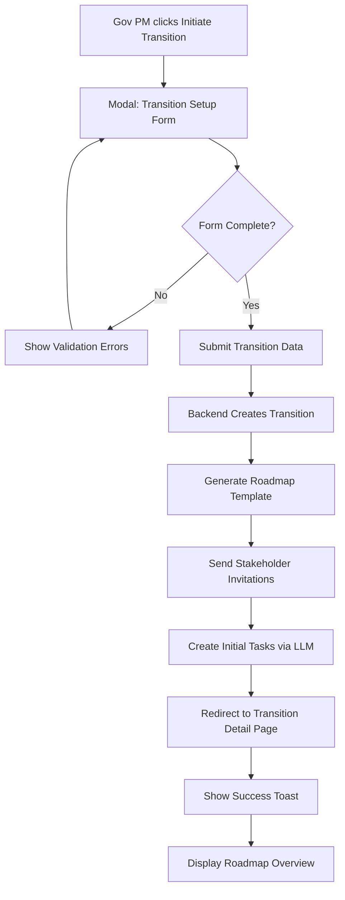
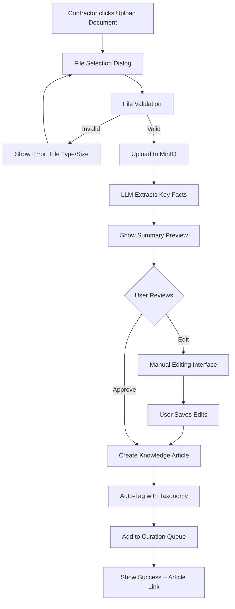
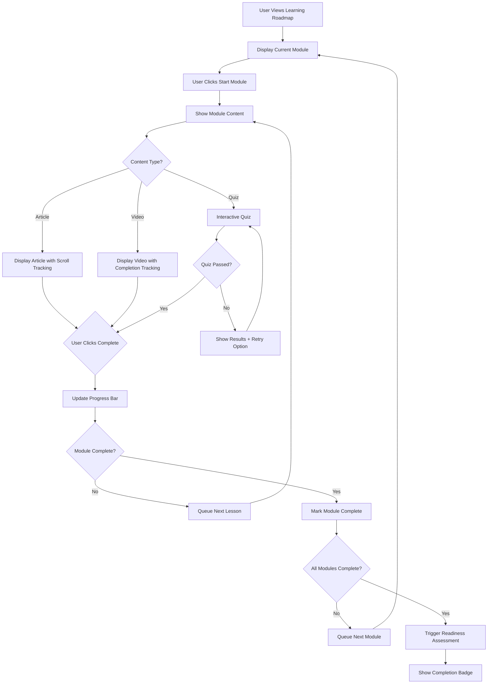

# Transition Management Roadmap UI - Frontend Specification

## Introduction

This document defines the user experience goals, information architecture, user flows, and visual design specifications for the Transition Management System's Roadmap UI components. It serves as the foundation for visual design and frontend development, ensuring a cohesive and user-centered experience.

### Overall UX Goals & Principles

#### Target User Personas

**Government Program Manager (PM):**
- **Needs:** High-level oversight, control, and monitoring of transition progress across multiple contracts
- **Goals:** Ensure smooth transitions, meet deadlines, manage risk, maintain operational continuity
- **Pain Points:** Lack of visibility into transition status, difficulty coordinating between outgoing/incoming contractors
- **Technical Proficiency:** Medium - familiar with project management tools

**Outgoing Contractor:**
- **Needs:** Clear guidance on what knowledge needs to be transferred, efficient documentation tools
- **Goals:** Complete transition tasks, document work thoroughly, ensure successful handover
- **Pain Points:** Unclear requirements, time pressure, repetitive documentation tasks
- **Technical Proficiency:** High - domain experts in their operational areas

**Incoming Contractor:**
- **Needs:** Role-specific learning paths, easy access to operational knowledge, ability to ask questions
- **Goals:** Get up to speed quickly, understand systems and processes, build confidence
- **Pain Points:** Information overload, unclear priorities, lack of contextual learning
- **Technical Proficiency:** Variable - new to the environment but experienced in their roles

#### Usability Goals

1. **Task Clarity:** Users can immediately understand what needs to be done next (< 5 seconds)
2. **Progress Transparency:** All stakeholders can see real-time transition status at appropriate detail levels
3. **Efficient Knowledge Transfer:** Outgoing contractors can document knowledge 50% faster than traditional methods
4. **Accelerated Onboarding:** Incoming contractors reach operational capability 30% faster
5. **Risk Visibility:** Government PMs can identify transition risks within 10 seconds of viewing dashboard

#### Design Principles

1. **Role-Specific Context** - Tailor views and information to user role and current phase
2. **Progressive Disclosure** - Show summary first, details on demand
3. **Status-Driven Design** - Use visual indicators (color, icons, progress) to communicate state
4. **Guided Workflows** - Provide clear next steps and process visibility
5. **Intelligent Assistance** - Use AI to reduce cognitive load and surface relevant information

#### Change Log

| Date | Version | Description | Author |
|------|---------|-------------|--------|
| 2025-10-13 | 1.0 | Initial specification based on wireframe review | Sally (UX Expert) |

---

## Information Architecture (IA)

### Site Map / Screen Inventory

```mermaid
graph TD
    A[🔄 Transition Management System] --> B[📊 Dashboard]
    A --> C[🏛️ Government PM]
    A --> D[📤 Outgoing Contractor]
    A --> E[📥 Incoming Contractor]
    A --> F[📚 Knowledge Base]
    A --> G[🔗 Integrations]

    B --> B1[System Overview]
    B --> B2[Active Transitions Widget]
    B --> B3[Recent Activities Timeline]
    B --> B4[AI Assistant Activity]
    B --> B5[Metrics Row]
    B --> B6[Process Flow Visualization]

    C --> C1[Platform Setup Widget]
    C --> C2[Knowledge Curation Queue]
    C --> C3[Transition Control Panel]
    C --> C4[Transition Roadmap Overview]

    D --> D1[Current Task Transition]
    D --> D2[Work Activity Summarization]
    D --> D3[Verification Checklist]

    E --> E1[My Learning Roadmap]
    E --> E2[Elements to Master]
    E --> E3[AI Knowledge Assistant]
    E --> E4[Contextual Learning Resources]

    F --> F1[Knowledge Grid Categories]
    F --> F2[Recent Updates Timeline]
    F --> F3[Version Tracking Widget]
    F --> F4[Taxonomy Evolution]

    G --> G1[n8n Webhook Workflows]
    G --> G2[LLM Integration Panel]
    G --> G3[External Systems Status]
    G --> G4[API Statistics]
```



### Navigation Structure

**Primary Navigation:** Horizontal tab-based navigation at page header level
- 6 main sections: Dashboard, Government PM, Outgoing Contractor, Incoming Contractor, Knowledge Base, Integrations
- Active tab indicated by purple underline and light purple background
- Icons + text labels for clarity and scannability
- Responsive: collapses to hamburger menu on mobile

**Secondary Navigation:** Within-section widget-based navigation
- No explicit secondary nav - users navigate by interacting with widgets
- Each widget is self-contained with clear action buttons or clickable elements
- Modal/slide-out panels used for deeper detail views

**Breadcrumb Strategy:** Not needed for current shallow hierarchy
- Consider adding if screens expand beyond 2 levels deep
- Would show: Home > [Section] > [Detail View]

---

## Component Library / Design System

### Design System Approach

**Framework:** Build custom components based on wireframe patterns
- Use existing project React + TypeScript stack
- Create reusable component library in `frontend/src/components/roadmap/`
- Leverage existing style guide patterns where applicable
- Design tokens for colors, spacing, typography

### Core Components

#### 1. **RoadmapWidget**

**Purpose:** Container component for dashboard information cards

**Variants:**
- Standard (white background, full padding)
- Highlighted (colored background for alerts/CTAs)
- Compact (reduced padding for dense information)

**States:**
- Default
- Hover (subtle elevation increase)
- Loading (skeleton state)
- Empty (placeholder content)

**Props:**
```typescript
interface RoadmapWidgetProps {
  title: string;
  icon?: string | ReactNode;
  badge?: number | string;
  variant?: 'standard' | 'highlighted' | 'compact';
  loading?: boolean;
  onHeaderClick?: () => void;
  children: ReactNode;
}
```

**Usage Guidelines:**
- Use title + icon for all widgets
- Badge displays counts or status indicators
- Keep content concise - link to detail views for more info
- Maintain consistent padding (20px) across all variants

---

#### 2. **ProcessFlowStep**

**Purpose:** Visual step indicator for multi-stage processes

**Variants:**
- Horizontal (default)
- Vertical (mobile/compact)

**States:**
- Not Started (gray circle, outlined)
- In Progress (gradient circle, pulsing animation)
- Complete (green circle with checkmark)
- Error (red circle with warning icon)

**Props:**
```typescript
interface ProcessFlowStepProps {
  stepNumber: number;
  title: string;
  description: string;
  status: 'not-started' | 'in-progress' | 'complete' | 'error';
  orientation?: 'horizontal' | 'vertical';
  isLast?: boolean;
}
```

**Usage Guidelines:**
- Always show 3-7 steps (optimal cognitive load)
- Use arrows between steps to show directionality
- Current step should be visually prominent
- Allow click to jump to step details

---

#### 3. **MetricCard**

**Purpose:** Display key performance indicators with visual emphasis

**Variants:**
- Standard gradient (default multi-color gradients)
- Status-based (green/yellow/red for health indicators)
- Neutral (for informational metrics)

**States:**
- Static
- Animated (value counting up/down on mount)
- Trending (with trend arrow and percentage)

**Props:**
```typescript
interface MetricCardProps {
  value: string | number;
  label: string;
  gradient?: string; // CSS gradient string
  trend?: {
    direction: 'up' | 'down' | 'stable';
    percentage: number;
  };
  animate?: boolean;
  onClick?: () => void;
}
```

**Usage Guidelines:**
- Use gradient backgrounds to differentiate metrics
- Large, bold numbers (36px+) for values
- Smaller supporting text (14px) for labels
- Keep labels concise (1-3 words)

---

#### 4. **TimelineItem**

**Purpose:** Display chronological events with visual timeline

**Variants:**
- Standard (border + dot indicator)
- Completed (green dot, checked)
- Pending (outlined dot)
- Highlighted (with background color)

**States:**
- Default
- Hover (slight scale and shadow)
- Expanded (shows additional details)
- Collapsed (summary only)

**Props:**
```typescript
interface TimelineItemProps {
  title: string;
  description: string;
  timestamp: Date | string;
  status: 'completed' | 'in-progress' | 'pending';
  author?: string;
  expandable?: boolean;
  onExpand?: () => void;
}
```

**Usage Guidelines:**
- Connect items with vertical line (2px, brand color)
- Most recent at top by default
- Use relative time ("2 hours ago") for recent items
- Absolute dates for items > 7 days old

---

#### 5. **UserProgressCard**

**Purpose:** Display user/transition information with progress indicator

**Variants:**
- Individual user (avatar + name + role)
- Transition summary (icon + name + category)

**States:**
- Default
- Hover (lift effect)
- Selected (border highlight)
- Loading

**Props:**
```typescript
interface UserProgressCardProps {
  avatar: string | { initials: string; color?: string };
  name: string;
  subtitle: string;
  progress: number; // 0-100
  status?: 'on-track' | 'at-risk' | 'delayed';
  onClick?: () => void;
}
```

**Usage Guidelines:**
- Avatar size: 50px for cards, 40px for compact lists
- Progress shown as large percentage (24px+)
- Use status colors: green (on-track), yellow (at-risk), red (delayed)
- Clickable to view detailed information

---

#### 6. **LLMChatInterface**

**Purpose:** Interactive AI chat component for Q&A

**Variants:**
- Embedded (within widget)
- Full-screen (modal or dedicated page)

**States:**
- Idle (awaiting input)
- Typing (user composing message)
- Thinking (AI processing, animated indicator)
- Responding (AI message streaming in)
- Error (connection/API issues)

**Props:**
```typescript
interface LLMChatInterfaceProps {
  context?: string; // e.g., "network-operations", "security"
  placeholder?: string;
  maxHeight?: string;
  onSubmit?: (message: string) => void;
  messages?: ChatMessage[];
  loading?: boolean;
}

interface ChatMessage {
  role: 'user' | 'assistant';
  content: string;
  timestamp: Date;
  references?: Array<{ title: string; url: string }>;
}
```

**Usage Guidelines:**
- Show conversation history (scrollable)
- Distinguish user vs AI messages (alignment, background)
- Include document references when AI cites sources
- Provide feedback mechanism (thumbs up/down)

---

#### 7. **KnowledgeCard**

**Purpose:** Clickable card for knowledge categories/articles

**Variants:**
- Category summary (with count)
- Document card (with metadata)

**States:**
- Default
- Hover (lift + border color change)
- Selected
- New/Updated (badge indicator)

**Props:**
```typescript
interface KnowledgeCardProps {
  title: string;
  count?: number;
  icon?: string;
  metadata?: {
    version?: string;
    lastUpdated?: Date;
    author?: string;
  };
  badge?: 'new' | 'updated';
  onClick?: () => void;
}
```

**Usage Guidelines:**
- Grid layout: 200px minimum width, responsive
- Use consistent iconography for categories
- Show update indicators for items < 3 days old
- Large count numbers with smaller label

---

#### 8. **WebhookStatusItem**

**Purpose:** Display integration/webhook status with live indicator

**Variants:**
- List item (default)
- Compact badge

**States:**
- Active (green pulsing dot)
- Testing (yellow steady dot)
- Offline (red dot)
- Unknown (gray dot)

**Props:**
```typescript
interface WebhookStatusItemProps {
  name: string;
  endpoint?: string;
  status: 'active' | 'testing' | 'offline' | 'unknown';
  lastTriggered?: Date;
  onClick?: () => void;
}
```

**Usage Guidelines:**
- Use pulsing animation for active status
- Show endpoint URL in monospace font
- Display relative time for last activity
- Clickable to view integration details/logs

---

#### 9. **TransitionRoadmapPanel**

**Purpose:** Display contract and personnel transition overview

**Variants:**
- Contract view (transition by contract)
- Personnel view (transition by role)
- Combined view (both sections)

**States:**
- Loading
- Default
- Expanded (detailed breakdown)

**Props:**
```typescript
interface TransitionRoadmapPanelProps {
  contracts: Array<{
    name: string;
    progress: number;
    status: 'on-track' | 'at-risk' | 'delayed';
  }>;
  personnel: Array<{
    role: string;
    count: number;
    status: 'ready' | 'training' | 'onboarding';
  }>;
  variant?: 'contract' | 'personnel' | 'combined';
}
```

**Usage Guidelines:**
- Use dashed border for integration/special panels
- Colored icon for panel type identification
- Two-column layout for contract vs personnel
- Progress percentages with status color coding

---

#### 10. **ChecklistWidget**

**Purpose:** Interactive checklist for verification tasks

**Variants:**
- Simple (checkboxes + labels)
- Detailed (with descriptions and due dates)

**States:**
- Editable (user can check/uncheck)
- Read-only (display only)
- Submitting (saving state)

**Props:**
```typescript
interface ChecklistWidgetProps {
  items: Array<{
    id: string;
    label: string;
    description?: string;
    completed: boolean;
    required?: boolean;
    dueDate?: Date;
  }>;
  readOnly?: boolean;
  onItemToggle?: (id: string, completed: boolean) => void;
  onSubmit?: () => void;
}
```

**Usage Guidelines:**
- Show completion progress (X of Y completed)
- Visual distinction for required vs optional items
- Disable submit until all required items checked
- Consider grouping into sections for long lists

---

## Branding & Style Guide

### Visual Identity

**Brand Guidelines:** Based on wireframe gradient system

- Modern, professional gradient-based design
- Purple/blue as primary brand colors (technology, trust, transformation)
- Clean, spacious layouts with clear hierarchy
- Friendly, approachable tone despite enterprise context

### Color Palette

| Color Type | Hex Code | Usage |
|------------|----------|-------|
| Primary | `#667eea` → `#764ba2` (gradient) | Primary buttons, active states, brand elements |
| Secondary | `#f093fb` → `#f5576c` (gradient) | Secondary CTAs, integration highlights |
| Accent | `#ffecd2` → `#fcb69f` (gradient) | LLM/AI-related components, warm highlights |
| Success | `#4CAF50` | Completed tasks, positive metrics, active status |
| Warning | `#ffc107` | At-risk items, pending reviews, testing status |
| Error | `#dc3545` | Failed tasks, critical alerts, offline status |
| Info | `#17a2b8` | Informational content, neutral status |
| Neutral Gray | `#f8f9fa` (light), `#666` (medium), `#333` (dark) | Backgrounds, text, borders |
| White | `#ffffff` | Card backgrounds, text on dark |

**Gradient Variations:**
- Cool gradient: `#84fab0` → `#8fd3f4` (metrics)
- Warm gradient: `#ffecd2` → `#fcb69f` (AI components)
- Pink gradient: `#f093fb` → `#f5576c` (alerts, urgency)
- Blue gradient: `#4facfe` → `#00f2fe` (informational)

### Typography

#### Font Families

- **Primary:** `-apple-system, BlinkMacSystemFont, 'Segoe UI', Roboto, 'Helvetica Neue', Arial, sans-serif` (system fonts)
- **Monospace:** `'Monaco', 'Menlo', 'Ubuntu Mono', monospace` (for code, endpoints, technical data)

#### Type Scale

| Element | Size | Weight | Line Height |
|---------|------|--------|-------------|
| H1 | 2.5em (40px) | Bold (700) | 1.2 |
| H2 | 1.5em (24px) | Bold (700) | 1.3 |
| H3 | 1.25em (20px) | Bold (700) | 1.4 |
| Widget Title | 18px | Bold (700) | 1.4 |
| Body | 16px | Regular (400) | 1.6 |
| Small | 14px | Regular (400) | 1.5 |
| Caption | 12px | Regular (400) | 1.4 |
| Metric Value | 36px | Bold (700) | 1.1 |
| Progress Percent | 24px | Bold (700) | 1.2 |

### Iconography

**Icon Library:** Emoji-based for wireframe; recommend **Lucide Icons** or **Heroicons** for production

**Icon Usage:**
- **Widget headers:** 30px circular gradient background, 16px icon, centered
- **Navigation tabs:** 20px icon, displayed inline with text
- **Status indicators:** 10-12px circular dots with status colors
- **Action buttons:** 16-18px icons, left-aligned with text

**Icon Guidelines:**
- Use consistently throughout the application
- Pair with text labels for clarity
- Ensure 4:5:1 contrast ratio for accessibility
- Animate on interaction (subtle scale or color change)

### Spacing & Layout

**Grid System:**
- 12-column responsive grid
- Container max-width: 1600px
- Gutter: 20px (desktop), 15px (tablet), 10px (mobile)

**Spacing Scale (8px base unit):**
- `xs`: 4px
- `sm`: 8px
- `md`: 15px
- `lg`: 20px
- `xl`: 30px
- `2xl`: 40px

**Layout Principles:**
- Widgets use consistent 20px padding
- 20px-30px gaps between widgets in dashboard grid
- 10px-15px spacing within widget content
- Full-bleed for header/navigation elements

---

## Accessibility Requirements

### Compliance Target

**Standard:** WCAG 2.1 Level AA compliance

### Key Requirements

**Visual:**
- Color contrast ratios: Minimum 4.5:1 for body text, 3:1 for large text and UI components
- Focus indicators: 2px solid outline with 4:1 contrast ratio, visible on all interactive elements
- Text sizing: Minimum 16px for body text, responsive scaling up to 200% without layout breaking

**Interaction:**
- Keyboard navigation: Full tab order, skip links, logical focus flow
- Screen reader support: ARIA labels, roles, and live regions for dynamic content
- Touch targets: Minimum 44x44px for interactive elements

**Content:**
- Alternative text: Descriptive alt text for all images, icons have aria-labels
- Heading structure: Proper semantic hierarchy (H1 → H2 → H3), no skipped levels
- Form labels: All inputs have visible labels, error messages, and instructions

### Testing Strategy

1. **Automated Testing:** Integrate axe-core or similar tool in CI/CD pipeline
2. **Manual Testing:** Quarterly audits with screen reader (NVDA/JAWS)
3. **Keyboard Testing:** All user flows testable with keyboard only
4. **Color Contrast:** Use tools like WebAIM contrast checker
5. **User Testing:** Include users with disabilities in testing cycles

---

## Responsiveness Strategy

### Breakpoints

| Breakpoint | Min Width | Max Width | Target Devices |
|------------|-----------|-----------|----------------|
| Mobile | 320px | 767px | Smartphones (portrait & landscape) |
| Tablet | 768px | 1023px | Tablets (portrait), small laptops |
| Desktop | 1024px | 1599px | Standard desktops, laptops |
| Wide | 1600px | - | Large monitors, ultra-wide displays |

### Adaptation Patterns

**Layout Changes:**
- **Mobile:** Single column, stacked widgets, collapsible sections
- **Tablet:** 1-2 column grid depending on widget complexity
- **Desktop:** 2-3 column grid with optimal information density
- **Wide:** Max 3-4 columns, increased whitespace, no stretching beyond 1600px

**Navigation Changes:**
- **Mobile:** Hamburger menu, tabs converted to dropdown
- **Tablet:** Horizontal scrolling tabs with scroll indicators
- **Desktop/Wide:** Full horizontal tab bar

**Content Priority:**
- **Mobile:** Show metrics first, hide secondary information in expandable sections
- **Tablet:** Balance between overview and detail
- **Desktop/Wide:** Show all information with optimal hierarchy

**Interaction Changes:**
- **Mobile:** Larger touch targets (48x48px minimum), swipe gestures for carousels
- **Tablet:** Hybrid touch + cursor interactions
- **Desktop/Wide:** Hover states, keyboard shortcuts, drag-and-drop

---

## Animation & Micro-interactions

### Motion Principles

- **Purpose-Driven:** Every animation serves a functional purpose (feedback, guidance, or relationship)
- **Performance-First:** Use CSS transforms and opacity for 60fps animations
- **Respectful:** Obey `prefers-reduced-motion` for accessibility
- **Subtle:** Animations should enhance, not distract (200-400ms sweet spot)

### Key Animations

- **Page Transition:** Fade-in with translateY (10px → 0) | Duration: 500ms, Easing: ease
- **Widget Hover:** Elevation increase (shadow blur 10px → 20px), translateY (-2px) | Duration: 300ms, Easing: ease-out
- **Tab Switch:** Fade-out old content (200ms), fade-in new content (300ms) | Total: 500ms, Easing: ease
- **Progress Bar Fill:** Animated width change | Duration: 800ms, Easing: cubic-bezier(0.4, 0, 0.2, 1)
- **Status Dot Pulse:** Scale (1 → 1.2 → 1), opacity (1 → 0.5 → 1) | Duration: 2000ms, Easing: ease-in-out, infinite
- **Metric Counter:** Number counting animation on mount | Duration: 1200ms, Easing: ease-out
- **Toast Notification:** Slide-in from top-right + fade | Duration: 400ms, Easing: ease-out
- **Modal Open/Close:** Scale (0.9 → 1) + fade, backdrop fade | Duration: 300ms, Easing: ease-out
- **Button Click:** Scale down (0.95) then return | Duration: 100ms, Easing: ease-in-out
- **Loading Skeleton:** Shimmer effect across placeholder | Duration: 1500ms, Easing: linear, infinite

---

## User Flows

### Flow 1: Government PM - Initiate New Transition

**User Goal:** Create a new transition project and assign initial stakeholders

**Entry Points:**
- Dashboard "Initiate New Transition" button
- Government PM view "Transition Control Panel"

**Success Criteria:**
- Transition created with unique ID
- Roadmap template generated
- Stakeholders invited via email
- Initial tasks created based on contract type

#### Flow Diagram



#### Edge Cases & Error Handling

- **Duplicate transition name:** Show inline error, suggest alternate names
- **Invalid email addresses:** Highlight problematic emails, allow correction
- **LLM task generation failure:** Use fallback template tasks, log error
- **Stakeholder invitation delivery failure:** Show warning, provide manual invite link
- **Network timeout:** Show retry option, save draft locally

**Notes:** Consider allowing PM to save as draft and complete setup later

---

### Flow 2: Outgoing Contractor - Document Knowledge

**User Goal:** Upload work documentation and create knowledge articles

**Entry Points:**
- Outgoing Contractor view "Work Activity Summarization" widget
- Knowledge Base "Create New Article" button

**Success Criteria:**
- Document uploaded successfully
- AI-generated summary reviewed and approved
- Knowledge article tagged and categorized
- Version created in knowledge base

#### Flow Diagram



#### Edge Cases & Error Handling

- **Large file size (>100MB):** Show chunked upload progress, allow resume
- **Corrupted file:** Detect early, provide clear error message
- **LLM extraction timeout:** Offer manual entry option
- **Duplicate content detected:** Warn user, suggest linking to existing article
- **Auto-tagging confidence low:** Present suggested tags for manual approval

**Notes:** Consider batch upload for multiple files with single summary

---

### Flow 3: Incoming Contractor - Personalized Learning Path

**User Goal:** Follow customized learning path and track progress

**Entry Points:**
- Incoming Contractor view "My Learning Roadmap" widget
- Login redirect for new incoming contractors

**Success Criteria:**
- User completes assigned learning module
- Progress updated in real-time
- Next module automatically queued
- Readiness assessment triggered at milestones

#### Flow Diagram



#### Edge Cases & Error Handling

- **Content not loading:** Show offline indicator, cache previously viewed content
- **Progress sync failure:** Queue locally, sync when connection restored
- **Quiz timeout:** Auto-save partial answers, allow resume
- **Assessment not available:** Allow user to continue, flag for PM review
- **User skips ahead:** Allow but mark as "incomplete" with lower confidence

**Notes:** Consider social features like peer discussion boards per module

---

## Performance Considerations

### Performance Goals

- **Initial Page Load (LCP):** < 2.5 seconds on 3G connection
- **Interaction Response (FID):** < 100ms for all user interactions
- **Animation FPS:** Maintain 60fps for all animations
- **API Response Time:** < 500ms for dashboard data, < 2s for LLM queries

### Design Strategies

1. **Lazy Loading:** Load widgets below fold on demand
2. **Skeleton Screens:** Show loading skeletons instead of spinners
3. **Optimistic Updates:** Update UI immediately, sync in background
4. **Pagination:** Limit initial data display (e.g., 5 timeline items, "Load more")
5. **Debounced Search:** Wait 300ms after typing before triggering search
6. **Cached LLM Responses:** Cache common questions/answers client-side
7. **Progressive Enhancement:** Load critical features first, enhance progressively
8. **Image Optimization:** Use modern formats (WebP), lazy load below fold images
9. **Code Splitting:** Lazy load route-specific components
10. **Virtual Scrolling:** For long lists (>100 items) use virtual scrolling

---

## Next Steps

### Immediate Actions

1. **Review with Stakeholders:** Present this spec to product owner and development team
2. **Create High-Fidelity Mockups:** Design detailed mockups in Figma based on components defined here
3. **Validate with Users:** Conduct usability testing with representative users from each persona
4. **Define API Contracts:** Work with backend team to define data structures for each component
5. **Prioritize Components:** Create implementation roadmap (MVP → Phase 2 → Phase 3)
6. **Setup Component Library:** Initialize component library structure in codebase
7. **Accessibility Audit:** Review designs with accessibility expert before development

### Design Handoff Checklist

- [x] All user flows documented
- [x] Component inventory complete
- [x] Accessibility requirements defined
- [x] Responsive strategy clear
- [x] Brand guidelines incorporated
- [x] Performance goals established
- [ ] High-fidelity mockups created (Next step)
- [ ] Component library initialized (Development team)
- [ ] API contracts documented (Backend team)
- [ ] User testing completed (UX Research)

---

## Appendix: Component Inventory Summary

### Dashboard Components
- RoadmapWidget (container)
- MetricCard (KPIs)
- ProcessFlowStep (5-step visualization)
- UserProgressCard (active transitions)
- TimelineItem (recent activities)
- LLMChatInterface (AI assistant)

### Government PM Components
- ChecklistWidget (platform setup)
- TransitionRoadmapPanel (contract/personnel overview)
- ActionButtonGroup (control panel CTAs)
- CurationQueueWidget (pending reviews)

### Outgoing Contractor Components
- TaskTransitionTimeline (handover tasks)
- ActivitySummaryWidget (work documentation stats)
- VerificationChecklist (completion checklist)

### Incoming Contractor Components
- LearningRoadmapWidget (progress tracking)
- MasteryChecklistWidget (elements to master)
- LLMChatInterface (knowledge assistant)
- ResourceCardGrid (contextual learning materials)

### Knowledge Base Components
- KnowledgeCard (category cards)
- TimelineItem (recent updates)
- VersionTrackingWidget (statistics)
- TaxonomyTagCloud (auto-generated categories)

### Integration Components
- WebhookStatusItem (n8n workflows)
- IntegrationPanel (container for integration sections)
- APIStatsGrid (metrics display)
- SystemConnectionCard (external system status)

---

## Technical Implementation Notes

### Recommended Tech Stack
- **UI Framework:** React 18+ with TypeScript
- **Styling:** CSS Modules or Styled Components (maintain existing pattern)
- **State Management:** React Context + hooks for widget state
- **Data Fetching:** React Query or SWR for server state
- **Charts/Visualizations:** Recharts or Chart.js (if needed)
- **Icons:** Lucide Icons or Heroicons
- **Forms:** React Hook Form + Zod validation
- **Animations:** Framer Motion or CSS animations

### File Structure
```
frontend/src/components/roadmap/
├── widgets/
│   ├── RoadmapWidget.tsx
│   ├── MetricCard.tsx
│   ├── TimelineItem.tsx
│   ├── UserProgressCard.tsx
│   └── ...
├── flows/
│   ├── ProcessFlowStep.tsx
│   └── ProcessFlow.tsx
├── chat/
│   ├── LLMChatInterface.tsx
│   ├── ChatMessage.tsx
│   └── ChatInput.tsx
├── knowledge/
│   ├── KnowledgeCard.tsx
│   └── KnowledgeGrid.tsx
├── integrations/
│   ├── WebhookStatusItem.tsx
│   ├── IntegrationPanel.tsx
│   └── ...
└── index.ts (barrel export)
```

### Component Development Guidelines
1. Create components in isolation (Storybook if available)
2. Write unit tests for logic, snapshot tests for UI
3. Document props with JSDoc comments
4. Export TypeScript interfaces for all prop types
5. Implement error boundaries for robust error handling
6. Use React.memo for expensive render components
7. Follow project's existing naming conventions

---

**Document Status:** ✅ Complete - Ready for Design Phase
**Last Updated:** 2025-10-13
**Next Review:** After high-fidelity mockup creation
