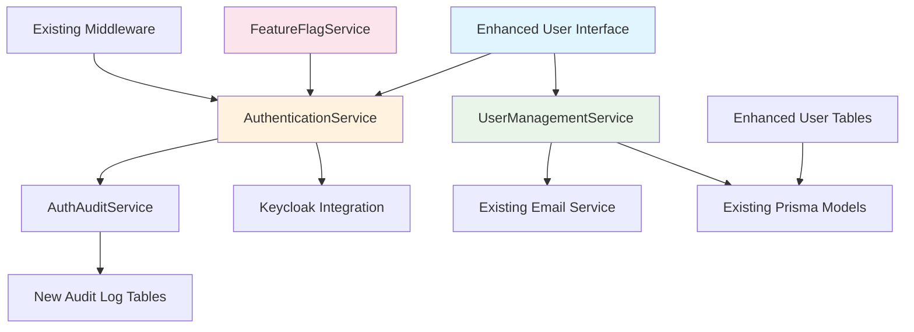

# Component Architecture

The new security components follow the existing TIP architectural patterns while adding necessary authentication and user management functionality.

## New Components

### AuthenticationService

**Responsibility:** Centralized authentication logic handling login, logout, and session management  
**Integration Points:** Integrates with existing Fastify middleware and Keycloak service configuration

**Key Interfaces:**
- `authenticateUser(credentials)` - Login validation against Keycloak
- `validateSession(token)` - Session verification for protected routes
- `logoutUser(sessionId)` - Proper session termination

**Dependencies:**
- **Existing Components:** Current Keycloak configuration, existing middleware patterns
- **New Components:** AuthAuditService for event logging

**Technology Stack:** Node.js with Fastify integration, following existing service patterns

### UserManagementService

**Responsibility:** Enhanced user management operations including invitations, status updates, and administrative controls  
**Integration Points:** Extends existing user management API routes with enhanced functionality

**Key Interfaces:**
- `inviteUser(userDetails)` - Send user invitations with proper error handling
- `resendInvitation(userId)` - Resend invitation functionality without Bad Request errors
- `updateUserStatus(userId, status)` - Accurate user status management
- `getUserCounts(filters)` - Real-time user count calculations with proper filtering

**Dependencies:**
- **Existing Components:** Current Prisma user models, existing email service integration
- **New Components:** AuthenticationService for user state validation

**Technology Stack:** Node.js service layer following established patterns

### EnhancedUserInterface

**Responsibility:** React components for authentication flows and enhanced user management interfaces  
**Integration Points:** Integrates with existing component library and state management patterns

**Key Interfaces:**
- `LoginPage` - Complete authentication interface with validation
- `UserManagementDashboard` - Enhanced user management with accurate counts
- `SettingsPage` - Profile management and administrative controls
- `UserProfileModal` - Account settings accessible from avatar dropdown

**Dependencies:**
- **Existing Components:** Current Tailwind CSS configuration, established component patterns
- **New Components:** AuthenticationService for API calls, enhanced state management

**Technology Stack:** React 18 with TypeScript, following existing component architecture

### FeatureFlagService

**Responsibility:** Feature flag management for gradual authentication rollout and safe deployment  
**Integration Points:** Integrates with existing configuration management and environment variables

**Key Interfaces:**
- `isFeatureEnabled(flagName, userId)` - Check feature flag status for specific users
- `setFeatureFlag(flagName, percentage)` - Set rollout percentage for gradual deployment
- `getUserCohort(userId)` - Determine user's feature flag cohort for consistent experience

**Dependencies:**
- **Existing Components:** Current environment configuration, existing middleware patterns
- **New Components:** AuthenticationService for user context determination

**Technology Stack:** Node.js service following existing patterns with database and environment integration

## Component Interaction Diagram

