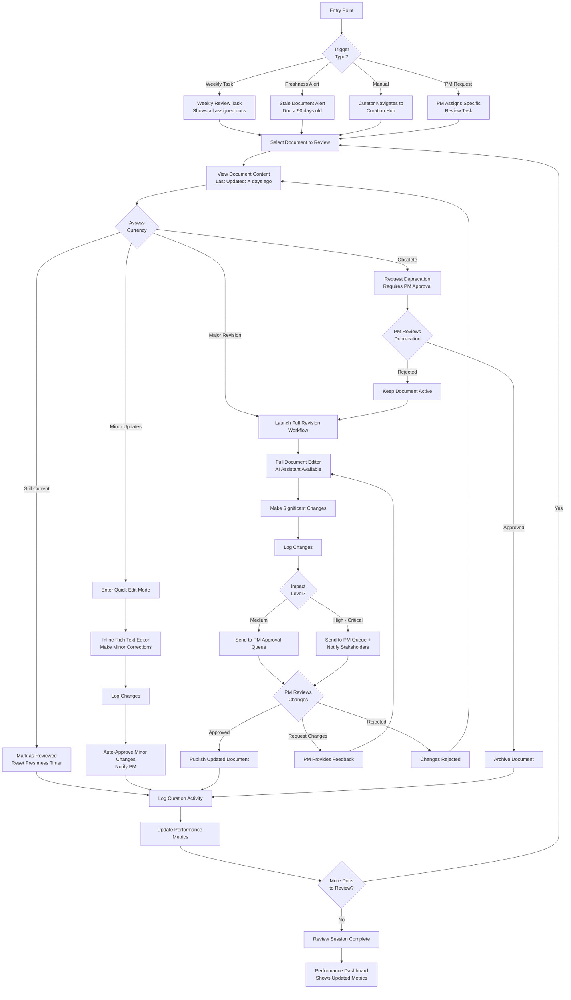

# TIP UI/UX Specification

**Project:** Transition Intelligence Platform (TIP)
**Version:** 2.0
**Date:** January 22, 2025
**Author:** Sally (UX Expert)
**Status:** Draft for Review

---

## Table of Contents

1. [Introduction](#introduction)
2. [Information Architecture](#information-architecture)
3. [User Flows](#user-flows)
4. [Wireframes & Mockups](#wireframes--mockups)
5. [Component Library / Design System](#component-library--design-system)
6. [Branding & Style Guide](#branding--style-guide)
7. [Accessibility Requirements](#accessibility-requirements)
8. [Responsiveness Strategy](#responsiveness-strategy)
9. [Animation & Micro-interactions](#animation--micro-interactions)
10. [Performance Considerations](#performance-considerations)
11. [Next Steps](#next-steps)

---

## Introduction

This document defines the user experience goals, information architecture, user flows, and visual design specifications for the Transition Intelligence Platform's user interface. It serves as the foundation for visual design and frontend development, ensuring a cohesive and user-centered experience.

### Context

This specification represents a **UX refocusing initiative** to center the application around its core purpose: **knowledge transition between government contractors and staff**. While the current implementation has strong technical foundations (RAG search, AI planning, RBAC), features are currently scattered across multiple navigation sections, creating friction in the knowledge transition workflow.

### Scope

This specification will redesign the information architecture to make **"My Transitions"** the primary entry point, with role-specific interfaces that consolidate all transition-related features into cohesive workflows.

---

## Overall UX Goals & Principles

### Target User Personas

**Primary Personas:**

1. **Contractor - Onboarding Phase (0-90 days)**
   - Focus: Absorbing knowledge, learning systems, building competency
   - Needs: Structured learning path, safe Q&A space, validation checkpoints
   - Success metric: Time to productivity, knowledge comprehension score
   - **UX Mode**: "Learning Mode" - emphasize consumption, guided paths

2. **Contractor - Operational Phase (3-36 months)** ⭐ PRIMARY FOCUS
   - Focus: **Maintaining knowledge currency**, curating new content, contributing documentation
   - Needs:
     - Easy content update workflows (edit existing docs, add new facts)
     - Knowledge freshness alerts ("this doc is 6 months old, please review")
     - Quick-capture tools (voice notes, screenshot annotations, daily logs)
     - Contribution metrics/recognition (gamification)
   - Success metric: Knowledge contribution rate, freshness score, peer validation
   - **UX Mode**: "Curator Mode" - emphasize contribution, maintenance, curation
   - **Key Insight**: This is the LONGEST phase of the contractor lifecycle - UX should optimize for this

3. **Contractor - Offboarding Phase (Final 60 days)**
   - Focus: Knowledge transfer, handoff checklist completion, training replacement
   - Needs: Clear exit requirements, handoff package generator, session scheduler
   - Success metric: Handoff completion %, successor readiness score
   - **UX Mode**: "Transfer Mode" - emphasize packaging, teaching, closure

4. **Program Manager (Persistent Role)**
   - Manages contractors through all lifecycle phases
   - Needs visibility into: onboarding progress, curation activity, handoff status
   - Success metric: Team knowledge continuity, zero knowledge loss incidents

**Secondary Personas:**
- Government Program Director (Portfolio oversight)
- Security Officer (Clearance/compliance enforcement)
- Operational Support (Knowledge curation/maintenance)

### Usability Goals

1. **Onboarding Speed**: Incoming contractors can identify first 30 days of critical tasks within 10 minutes of login
2. **Knowledge Currency**: Operational contractors can update/add knowledge in <5 minutes using quick-capture tools
3. **Curation Visibility**: System surfaces stale content weekly, tracks freshness score per product/program
4. **Handoff Clarity**: Departing contractors see transition completion % and remaining tasks at a glance
5. **Lifecycle Transitions**: System auto-suggests role phase transitions (e.g., "You've completed onboarding milestones - switch to Curator Mode?")
6. **Knowledge Findability**: Users can locate relevant knowledge in <30 seconds via semantic search

### Design Principles

1. **Workflow-First, Feature-Second** - Organize UI around user journeys (handoff, onboarding, oversight) not technical capabilities (documents, tasks, users)

2. **Lifecycle Awareness** - UI adapts to contractor lifecycle phase. Same person sees different default views as they progress: Learn → Curate → Transfer. System guides phase transitions.

3. **Curation as Daily Habit, Not Admin Task** - Knowledge updates embedded in operational workflow (not separate "go to Knowledge section"). Quick-capture: "As you work, capture what you learn" (floating widget, keyboard shortcuts). Freshness reminders integrated.

4. **Context Over Navigation** - Reduce navigation hops by surfacing related information in-context (knowledge within transition workspace, not separate section)

5. **Proactive Assistance** - System identifies gaps, suggests next actions, alerts to risks - don't make users hunt for problems

6. **Contribution Recognition** - Track and celebrate knowledge curation (leaderboards, metrics, badges). Make invisible work visible.

### Change Log

| Date | Version | Description | Author |
|------|---------|-------------|--------|
| 2025-01-22 | 2.0 | Complete UX refocusing specification - lifecycle model, curation hub, brand alignment | Sally (UX Expert) |

---

## Information Architecture (IA)

### Site Map / Screen Inventory

```mermaid
graph TD
    ROOT[TIP Application]

    %% Top-Level Navigation
    ROOT --> DASH[My Dashboard]
    ROOT --> KNOWLEDGE[My Knowledge Work]
    ROOT --> TRANSITIONS[My Transitions]
    ROOT --> PRODUCTS[Products & Programs]
    ROOT --> ADMIN[Administration]

    %% My Dashboard - Lifecycle Aware
    DASH --> DASH_ONBOARD[Onboarding Dashboard]
    DASH --> DASH_CURATOR[Curation Hub]
    DASH --> DASH_OFFBOARD[Handoff Dashboard]
    DASH --> DASH_PM[PM Transition Hub]
    DASH --> DASH_DIR[Executive Portfolio Dashboard]

    %% Onboarding Dashboard
    DASH_ONBOARD --> OB_JOURNEY[30/60/90 Day Journey]
    DASH_ONBOARD --> OB_LEARNING[Learning Path]
    DASH_ONBOARD --> OB_SKILLS[Skills Assessment]
    DASH_ONBOARD --> OB_QA[Ask Me Anything / Q&A]
    DASH_ONBOARD --> OB_WINS[Quick Wins Tracker]
    DASH_ONBOARD --> OB_STATUS[PIV/Clearance Status]

    %% Curation Hub
    DASH_CURATOR --> CUR_ASSIGN[My Curation Assignments]
    DASH_CURATOR --> CUR_QUICK[Quick Capture Tools]
    DASH_CURATOR --> CUR_WORKFLOWS[Curation Workflows]
    DASH_CURATOR --> CUR_PERF[Performance Dashboard]
    DASH_CURATOR --> CUR_HEALTH[Knowledge Health Monitoring]

    %% Curation Workflows Detail
    CUR_WORKFLOWS --> WF_DOC[Document Refresh Workflow]
    CUR_WORKFLOWS --> WF_FACT[Fact Update Workflow]
    CUR_WORKFLOWS --> WF_GAP[Knowledge Gap Filing]
    CUR_WORKFLOWS --> WF_READY[Transition Readiness Prep]

    %% Handoff Dashboard
    DASH_OFFBOARD --> OFF_CHECKLIST[Handoff Checklist]
    DASH_OFFBOARD --> OFF_SESSIONS[Knowledge Transfer Sessions]
    DASH_OFFBOARD --> OFF_PACKAGE[Handoff Package Generator]
    DASH_OFFBOARD --> OFF_PROGRESS[Completion Progress]
    DASH_OFFBOARD --> OFF_EXIT[Exit Interview]

    %% PM Transition Hub
    DASH_PM --> PM_HEALTH[Transition Health Scorecard]
    DASH_PM --> PM_GAPS[Knowledge Gap Analysis]
    DASH_PM --> PM_APPROVALS[Artifact Approval Queue]
    DASH_PM --> PM_TEAM[Team Readiness Status]
    DASH_PM --> PM_REPORTS[Reporting & Analytics]

    %% My Knowledge Work
    KNOWLEDGE --> KW_SEARCH[Search & Discovery]
    KNOWLEDGE --> KW_MYDOCS[My Documents]
    KNOWLEDGE --> KW_RECENT[Recent Activity]
    KNOWLEDGE --> KW_CURATION[Weekly Curation Review]
    KNOWLEDGE --> KW_APPROVAL[Approval Queue]
    KNOWLEDGE --> KW_UPLOAD[Document Upload]

    %% Search & Discovery
    KW_SEARCH --> SEARCH_SEMANTIC[Semantic Search]
    KW_SEARCH --> SEARCH_BROWSE[Browse by Category]
    KW_SEARCH --> SEARCH_TAGS[Browse by Tags]

    %% My Transitions
    TRANSITIONS --> TRANS_ACTIVE[Active Transitions]
    TRANSITIONS --> TRANS_COMPLETE[Completed Transitions]
    TRANSITIONS --> TRANS_TEMPLATES[Transition Templates]

    %% Active Transitions Detail
    TRANS_ACTIVE --> TRANS_DETAIL[Transition Workspace]
    TRANS_DETAIL --> TD_OVERVIEW[Overview & Timeline]
    TRANS_DETAIL --> TD_KNOWLEDGE[Knowledge Library]
    TRANS_DETAIL --> TD_TASKS[Tasks & Milestones]
    TRANS_DETAIL --> TD_TEAM[Team Members]
    TRANS_DETAIL --> TD_COMM[Communication Log]
    TRANS_DETAIL --> TD_STATUS[Status Reports]

    %% Products & Programs
    PRODUCTS --> PROD_LIST[Active Products/Programs]
    PRODUCTS --> PROD_ARCHIVE[Archived Products]

    PROD_LIST --> PROD_DETAIL[Product/Program Detail]
    PROD_DETAIL --> PD_OVERVIEW[Overview]
    PROD_DETAIL --> PD_KNOWLEDGE[Knowledge Context]
    PROD_DETAIL --> PD_TASKS[Tasks & Milestones]
    PROD_DETAIL --> PD_TEAM[Stakeholders]
    PROD_DETAIL --> PD_OPERATIONS[Business Operations]

    %% Administration
    ADMIN --> ADM_USERS[User Management]
    ADMIN --> ADM_SECURITY[Security & Access]
    ADMIN --> ADM_CONFIG[System Configuration]
    ADMIN --> ADM_ANALYTICS[Analytics & Reporting]

    %% Quick Capture - Omnipresent
    ROOT -.->|Floating Button + Cmd+Shift+K| QUICK_CAPTURE[Quick Capture Modal]
    QUICK_CAPTURE --> QC_NOTE[Quick Note]
    QUICK_CAPTURE --> QC_VOICE[Voice Memo]
    QUICK_CAPTURE --> QC_SCREEN[Screenshot Capture]
    QUICK_CAPTURE --> QC_LOG[Daily Work Log]
```



### Navigation Structure

#### Primary Navigation (Sidebar - Always Visible on Desktop)

**Lifecycle-Aware Dynamic Navigation:**

The sidebar adapts based on:
1. **User's current lifecycle phase** (Onboarding, Operational, Offboarding)
2. **User's role** (Program Manager, Director, Security Officer, etc.)
3. **Active assignments** (which transitions, products, curations they're assigned to)

**Example: Contractor in Operational Phase**
```
┌─────────────────────────────────┐
│  TIP Navigation                 │
├─────────────────────────────────┤
│                                 │
│  🏠 My Dashboard                │
│     └─ Curation Hub ⭐ (active) │
│                                 │
│  📚 My Knowledge Work            │
│     ├─ Quick Capture            │
│     ├─ My Assignments (12)      │
│     ├─ Freshness Alerts (3)     │
│     └─ Search & Discovery       │
│                                 │
│  🔄 My Transitions               │
│     └─ No active transitions    │
│                                 │
│  🏢 Products & Programs          │
│     ├─ F-35 Maintenance (mine)  │
│     ├─ Deployment Automation    │
│     └─ Browse All Products      │
│                                 │
│  ⚙️ Settings                    │
│     └─ My Profile               │
│                                 │
└─────────────────────────────────┘
```

#### Secondary Navigation (Contextual - Within Pages)

**Pattern: Tabbed Interface for Detail Views**

When viewing a specific entity (Transition, Product, Document), secondary navigation appears as tabs:

**Example: Transition Workspace Tabs**
```
[Overview] [Knowledge] [Tasks] [Team] [Timeline] [Reports]
   ↑ active
━━━━━━━━━━━━━━━━━━━━━━━━━━━━━━━━━━━━━━━━━━━━━━━━━━━━━━━━
```

#### Breadcrumb Strategy

**Purpose:** Show user's location in hierarchy and enable quick navigation to parent levels

**Pattern:** `Home > Section > Subsection > Current Page`

**Examples:**
```
Contractor in Curation Workflow:
Home > My Knowledge Work > Curation Workflows > Document Refresh

PM reviewing approval:
Home > My Dashboard > Approval Queue > "F-35 Deployment Process" Document Review

Contractor viewing transition detail:
Home > My Transitions > F-35 Maintenance Onboarding > Knowledge Library
```

---

## User Flows

### Flow 1: Contractor Lifecycle Journey (Meta-Flow)

**User Goal:** Progress through the complete contractor lifecycle from hiring to departure while maintaining knowledge continuity

**Entry Points:**
- User account created by PM/Admin
- Role: Initially "Incoming Contractor"
- Assigned to transition and product/program

**Success Criteria:**
- Completes onboarding within 90 days
- Transitions to Operational Support role
- Maintains knowledge domain throughout contract
- Successfully hands off knowledge before departure
- Zero critical knowledge loss

#### Flow Diagram



```mermaid
graph TD
    START[New Contractor Hired] --> ACCOUNT[Account Created<br/>Role: Incoming Contractor]

    ACCOUNT --> ONBOARD_START{Has Active<br/>Transition?}
    ONBOARD_START -->|Yes| ONBOARD_ASSIGNED[Assigned to Onboarding Transition]
    ONBOARD_START -->|No| ONBOARD_CREATED[PM Creates Transition]

    ONBOARD_ASSIGNED --> ONBOARD_DASH[Access Onboarding Dashboard]
    ONBOARD_CREATED --> ONBOARD_DASH

    ONBOARD_DASH --> ONBOARD_TASKS[Complete Onboarding Tasks:<br/>- Learning modules<br/>- Skills assessment<br/>- Knowledge review<br/>- Meet stakeholders]

    ONBOARD_TASKS --> ONBOARD_PROGRESS{Progress<br/>Check}
    ONBOARD_PROGRESS -->|< 90 days| ONBOARD_TASKS
    ONBOARD_PROGRESS -->|90 days + milestones met| ROLE_TRANSITION[Role Transition Trigger]
    ONBOARD_PROGRESS -->|90 days + incomplete| PM_REVIEW[PM Reviews Progress]

    PM_REVIEW -->|Approve transition| ROLE_TRANSITION
    PM_REVIEW -->|Extend onboarding| ONBOARD_EXTENSION[Extend Onboarding Period<br/>Add note to record]
    PM_REVIEW -->|Transfer/Terminate| EXIT_EARLY[Early Exit Flow]

    ONBOARD_EXTENSION --> ONBOARD_TASKS

    ROLE_TRANSITION --> ROLE_ADD[Add Operational Support Role<br/>Keep Incoming Contractor Role]
    ROLE_ADD --> NAV_CHANGE[Navigation Updates:<br/>Curation Hub Now Visible]

    NAV_CHANGE --> ASSIGN_DOMAIN[PM Assigns Knowledge Domain]
    ASSIGN_DOMAIN --> CURATOR_DASH[Access Curation Hub]

    CURATOR_DASH --> CURATOR_WORK[Operational Phase Work:<br/>- Weekly document reviews<br/>- Fact updates<br/>- Knowledge gap filing<br/>- Quick captures<br/>- Peer reviews]

    CURATOR_WORK --> CURATOR_LOOP{Contract<br/>Continuing?}
    CURATOR_LOOP -->|Yes, > 60 days remaining| CURATOR_WORK
    CURATOR_LOOP -->|60 days remaining| OFFBOARD_TRIGGER[Offboarding Trigger]
    CURATOR_LOOP -->|Transfer to other project| TRANSFER_FLOW[Knowledge Transfer Flow]

    OFFBOARD_TRIGGER --> ROLE_ADD_DEPART[Add Departing Contractor Role<br/>Keep Operational Support Role]
    ROLE_ADD_DEPART --> OFFBOARD_DASH[Access Handoff Dashboard]

    OFFBOARD_DASH --> OFFBOARD_TASKS[Complete Handoff Tasks:<br/>- Final knowledge audit<br/>- Package knowledge<br/>- Schedule transfer sessions<br/>- Train replacement<br/>- Exit interview]

    OFFBOARD_TASKS --> OFFBOARD_PROGRESS{Handoff<br/>Complete?}
    OFFBOARD_PROGRESS -->|No| OFFBOARD_TASKS
    OFFBOARD_PROGRESS -->|Yes| PM_APPROVE_EXIT[PM Reviews Handoff Package]

    PM_APPROVE_EXIT -->|Approved| EXIT_COMPLETE[Contract Ends<br/>Knowledge Transferred ✓]
    PM_APPROVE_EXIT -->|Gaps Found| OFFBOARD_REMEDIATE[Remediate Knowledge Gaps]

    OFFBOARD_REMEDIATE --> OFFBOARD_TASKS

    TRANSFER_FLOW --> TRANSFER_KNOWLEDGE[Transfer Knowledge to<br/>New Product Team]
    TRANSFER_KNOWLEDGE --> REASSIGN[Reassign to New Product<br/>Continue as Operational Support]
    REASSIGN --> CURATOR_WORK

    EXIT_EARLY --> EARLY_HANDOFF[Emergency Handoff Process<br/>Track incomplete knowledge]
    EARLY_HANDOFF --> EXIT_COMPLETE

    EXIT_COMPLETE --> ARCHIVE[Archive User Account<br/>Preserve Contribution History]
```

### Flow 2: Document Curation Workflow (Operational Phase)

**User Goal:** Maintain assigned knowledge domain by regularly reviewing and updating documentation to ensure accuracy and freshness

**Entry Points:**
- Weekly automated review task notification
- Freshness alert (document >90 days old)
- Manual review initiated by curator
- PM requests specific document review

**Success Criteria:**
- Document reviewed and status updated
- Changes logged with clear rationale
- PM approves major changes (if applicable)
- Performance metrics updated
- Knowledge freshness maintained above 95% target

#### Flow Diagram



### Additional Flows (Summary)

**Flow 3: Knowledge Gap Discovery to Documentation**
- Entry: Gap discovered (contractor question, curator finds, PM identifies, AI detects)
- Process: Log gap → Assess → Assign → AI-assisted drafting → Tag for transitions → Submit for approval
- Success: Gap filled, documentation published, linked to products/transitions

**Flow 4: PM Creates and Manages Transition**
- Entry: New contract award, contract ending, internal transfer
- Process: Transition setup wizard → Assign team → Define knowledge scope → AI/manual planning → Monitor health → Approve phase transitions → Complete handoff
- Success: Transition created, team assigned, monitored through lifecycle, handoff approved

**Flow 5: Quick Capture to Formalized Documentation**
- Entry: FAB click, keyboard shortcut, context menu, end-of-day prompt
- Process: Capture (note/voice/screenshot/log) → Auto-detect context → Tag → Link → Follow-up → Later: Convert to formal doc
- Success: Knowledge captured without workflow interruption, later formalized into documentation

---

## Wireframes & Mockups

### Primary Design Files

**Recommended Design Tool:** **Figma**

**Design File Structure:**
```
TIP - Transition Intelligence Platform (Figma Project)
│
├─── 01 - Design System
│    ├─ Colors, Typography, Spacing
│    ├─ Component Library
│    └─ Iconography
│
├─── 02 - Lifecycle Dashboards
│    ├─ Onboarding Dashboard
│    ├─ Curation Hub (Operational)
│    ├─ Handoff Dashboard (Offboarding)
│    └─ PM Transition Hub
│
├─── 03 - Curation Workflows
│    ├─ Document Refresh Workflow
│    ├─ Fact Update Workflow
│    ├─ Knowledge Gap Filing
│    └─ Quick Capture Modal
│
├─── 04 - Transition Management
│    ├─ Transition Workspace (Tabbed)
│    ├─ Transition Setup Wizard
│    └─ Knowledge Transfer Sessions
│
├─── 05 - Knowledge Management
│    ├─ Semantic Search Interface
│    ├─ Document Viewer
│    └─ Knowledge Library
│
└─── 06 - Mobile Responsive Views
     └─ Key screens adapted for tablet/mobile
```

### Key Screen Layouts

#### Screen 1: Curation Hub (Primary Operational Interface)

**Purpose:** Central workspace for contractors in Operational Support phase to manage all knowledge curation activities, track performance, and maintain knowledge domain freshness.

**Key Elements:**

**Header Section:**
- Page title: "Curation Hub"
- Lifecycle phase indicator badge: "Operational Support" (with icon)
- Performance score widget (compact): "Curation Score: 94/100" with progress ring
- Quick action buttons: [+ Quick Capture] [View Performance] [Settings]

**Main Content Area - 60/40 Layout:**

**Left Column (60%):**
1. Active Assignments (3 knowledge domain cards)
2. This Week's Tasks (checklist with progress bar)
3. Recent Quick Captures (last 5 with quick actions)

**Right Column (40% - Sidebar):**
1. Performance Snapshot Widget
2. Alerts & Notifications
3. Transition Readiness Score
4. Contribution Leaderboard (gamification)

**Floating Quick Capture Button:** Bottom-right corner, circular FAB with ✏️ icon

#### Screen 2: Onboarding Dashboard (Incoming Contractor)

**Purpose:** Guide incoming contractors through structured 30/60/90 day onboarding journey with clear milestones, learning paths, and quick wins tracking.

**Key Elements:**

**Hero Section:**
- Welcome message (personalized)
- Onboarding phase badge: "Day 23 of 90"
- Overall progress: Large circular progress (23% complete)

**Timeline Visualization:** Horizontal 3-phase timeline (First 30 Days → Days 31-60 → Days 61-90)

**3-Column Layout:**
- Column 1: Today's Priorities, This Week's Milestones
- Column 2: Learning Modules (accordion), Skills Assessment
- Column 3: Ask Me Anything Q&A, My Team, Quick Wins Tracker, PIV/Clearance Status

#### Screen 3: Handoff Dashboard (Departing Contractor)

**Purpose:** Provide clear visibility into handoff requirements, completion status, and ensure departing contractor can successfully transfer knowledge before departure.

**Key Elements:**

**Hero Section:**
- Alert banner: "Contract ends in 45 days - Handoff in progress"
- Handoff completion score: 72% complete
- Call-to-action: "8 tasks remaining"

**Main Content:** Handoff Checklist organized by category (expandable):
1. Knowledge Documentation (75% complete)
2. Knowledge Transfer Sessions (50% complete)
3. Successor Training (60% complete)
4. Administrative Tasks (40% complete)
5. Final Deliverables (0% complete)

**Right Sidebar:**
- Handoff Package Preview
- Knowledge Transfer Sessions Timeline
- Incoming Contractor Progress
- Exit Interview Prep
- Performance Summary

#### Screen 4: PM Transition Hub

**Purpose:** Provide Program Managers with comprehensive oversight of all active transitions, health monitoring, approval queue, and team performance tracking.

**Key Elements:**

**Header:** Active transitions count, alert badges, quick actions

**Filter/View Controls:** Tabs (All/Onboarding/Offboarding/Operational), Sort, View mode (Cards/List/Timeline)

**Main Content:** Transition Cards Grid (3 columns)
- Each card shows: Health score, team, progress metrics, next milestone, quick actions

**Right Sidebar:**
- Pending Approvals (6 items)
- Knowledge Gap Alerts (12 gaps)
- Team Performance Summary

**Bottom:** Timeline View (horizontal gantt-style chart)

#### Screen 5: Quick Capture Modal (Omnipresent)

**Purpose:** Enable frictionless knowledge capture from anywhere in the application without disrupting user workflow.

**Modal Design (600px width, centered overlay):**

**Header:** Icon + Title, Close button, Keyboard shortcut reminder

**Capture Type Selector:** Tabs for [📝 Note] [🎤 Voice] [📸 Screenshot] [📋 Log]

**Main Content:**
- Context Detection (auto-filled)
- Large text area or capture interface
- Metadata (optional): Tags, Link To, Follow-up Action

**Footer Actions:** [Advanced Options ▼] [Save & Continue Working] [Save & View in Knowledge Base] [Cancel]

#### Screen 6: Document Refresh Workflow

**Purpose:** Guide curators through systematic document review and update process with clear decision points and change logging.

**Step Indicator:** Step 1: Assess → Step 2: Update → Step 3: Log Changes → Step 4: Submit

**Main Layout:**
- Left 50%: Document Preview (read-only)
- Right 50%: Assessment Form or Editor (depending on step)

**Step 1:** Assessment with 4 radio button cards (Still Current, Minor Updates, Major Revision, Obsolete)

**Step 2:** Editing Interface (inline for minor, full editor for major)

**Step 3:** Change Summary Form (change summary, type, impact level, evidence)

**Step 4:** Review Summary Screen (side-by-side diff, approval routing)

#### Screen 7: Transition Workspace (Tabbed Detail View)

**Purpose:** Provide comprehensive view of all transition-related information in a single workspace with contextual tabs.

**Header:** Transition name, status badges, health score, quick actions

**Tab Navigation:** [Overview] [Knowledge] [Tasks] [Team] [Timeline] [Communication] [Reports]

**Overview Tab:**
- Hero Metrics (3-column grid): Progress, Knowledge, Team Readiness
- Next Milestones (timeline widget)
- Recent Activity Feed
- Critical Alerts

**Other Tabs:** Each tab has specific layout optimized for that content type (Knowledge: library with search, Tasks: kanban board, Team: member cards, Timeline: gantt chart, etc.)

---

## Component Library / Design System

### Design System Approach

**Strategy:** **Build on existing foundation (shadcn/ui) + Custom TIP-specific components**

**Design System Stack:**
```
TIP Design System
│
├─── Foundation Layer (Already Implemented)
│    ├─ shadcn/ui components (Button, Dialog, Card, etc.)
│    ├─ Radix UI primitives (accessibility built-in)
│    └─ Tailwind CSS utility classes
│
├─── Extension Layer (Custom TIP Components)
│    ├─ Lifecycle-aware components (badges, dashboards)
│    ├─ Knowledge-specific components (quick capture, curation cards)
│    ├─ Transition management components (health scorecard, timeline)
│    └─ Data visualization components (progress rings, charts)
│
└─── Pattern Library
     ├─ Layout patterns (dashboard grid, tabbed workspace)
     ├─ Interaction patterns (wizards, approval flows)
     └─ Workflow templates (curation workflow, gap filling)
```

### Core Components

#### Component 1: Lifecycle Phase Badge

**Purpose:** Visually indicate which lifecycle phase a contractor is in (Onboarding, Operational, Offboarding)

**Variants:** `onboarding`, `operational`, `offboarding`, `complete`

**States:** Default, Interactive, Compact, Extended

**Component API:**
```tsx
interface LifecyclePhaseBadgeProps {
  phase: 'onboarding' | 'operational' | 'offboarding' | 'complete';
  variant?: 'default' | 'compact' | 'extended';
  dayCount?: number;
  totalDays?: number;
  interactive?: boolean;
  className?: string;
}
```

#### Component 2: Health Scorecard

**Purpose:** Display transition health score with visual indicator, breakdown metrics, and trend information

**Variants:** `summary`, `detailed`, `compact`

**States:** Healthy (90-100), On Track (75-89), At Risk (60-74), Critical (<60)

**Component API:**
```tsx
interface HealthScorecardProps {
  score: number; // 0-100
  variant?: 'summary' | 'detailed' | 'compact';
  breakdown?: {
    taskCompletion: number;
    knowledgeFreshness: number;
    teamReadiness: number;
  };
  trend?: 'up' | 'down' | 'stable';
  onDrillDown?: () => void;
  size?: 'sm' | 'md' | 'lg';
  className?: string;
}
```

**Calculation Algorithm:**
```typescript
function calculateHealthScore(metrics: {
  taskCompletionPercent: number;
  knowledgeFreshnessPercent: number;
  teamReadinessPercent: number;
  daysRemaining: number;
  totalDays: number;
}): number {
  const timeProgress = (metrics.totalDays - metrics.daysRemaining) / metrics.totalDays;

  // Weighted calculation
  const weightedScore =
    (metrics.taskCompletionPercent * 0.4) +    // 40% weight
    (metrics.knowledgeFreshnessPercent * 0.3) + // 30% weight
    (metrics.teamReadinessPercent * 0.3);       // 30% weight

  // Adjust for time remaining
  const expectedProgress = timeProgress * 100;
  const progressGap = weightedScore - expectedProgress;

  return Math.max(0, Math.min(100, weightedScore + (progressGap * 0.1)));
}
```

#### Component 3: Quick Capture Button (FAB)

**Purpose:** Omnipresent floating action button that launches Quick Capture modal

**Variants:** `default`, `minimal`, `expanded`

**States:** Default, Hover, Active, Hidden

**Position:** Fixed bottom-right corner, 24px from edges

**Component API:**
```tsx
interface QuickCaptureFABProps {
  variant?: 'default' | 'minimal' | 'expanded';
  position?: 'bottom-right' | 'bottom-left' | 'top-right';
  onCapture: () => void;
  keyboardShortcut?: string; // Default: "Cmd+Shift+K"
  pulseOnMount?: boolean;
  hidden?: boolean;
  className?: string;
}
```

#### Additional Components (Summary)

4. **Curation Assignment Card** - Display knowledge domain with freshness score and quick actions
5. **Progress Ring** - Circular progress visualization for scores/percentages
6. **Timeline Visualization** - Horizontal timeline (milestone/Gantt variants)
7. **Knowledge Gap Card** - Gap display with priority and assignment
8. **Approval Queue Item** - PM approval card with preview and actions
9. **Performance Metric Widget** - Curation performance display
10. **Workflow Step Indicator** - Multi-step wizard progress indicator

---

## Branding & Style Guide

### Visual Identity

**Brand Positioning:**
- **Industry**: Government/Defense contracting, Knowledge management
- **Personality**: Professional, Trustworthy, Efficient, Supportive
- **Voice**: Clear, Direct, Empathetic, Empowering
- **Visual Style**: Clean, Modern, Data-focused, Accessible

**Existing Brand Assets:**
- Logo: TIP Logo (analyzed and colors extracted)
- Primary brand color: Navy Teal (from logo)
- Typography: System fonts (performance-first)

### Color Palette

**TIP Logo Color Analysis:**

The logo beautifully represents TIP's mission:
- **Open Book** = Knowledge base
- **Circuit Board Pattern** = Technology/Intelligence
- **Upward Arrow** = Growth/Progress/Transition
- **Circular Flow** = Continuous knowledge cycle
- **Connected Nodes** = Network of knowledge

#### Brand Colors (Extracted from Logo)

| Color Name | Hex Code | Tailwind | Usage | Logo Element |
|------------|----------|----------|-------|--------------|
| **Navy Teal (Primary)** | `#155E75` | `cyan-800` | Primary actions, navigation, headers | Logo background circle |
| **Emerald Teal (Accent)** | `#14B8A6` | `teal-500` | Success states, growth indicators | Growth arrow |
| **Warm Gold (Highlight)** | `#FCD34D` | `amber-300` | Special badges, achievements | Circuit nodes |
| **Ivory White** | `#F9FAFB` | `gray-50` | Clarity, backgrounds | Book illustration |

#### Semantic Colors

| Color Type | Hex Code | Tailwind Class | Usage |
|------------|----------|----------------|-------|
| **Success** | `#14B8A6` | `teal-500` | ✅ Completed tasks, approved items (brand-aligned) |
| **Warning** | `#F59E0B` | `amber-500` | ⚠️ Cautions, at-risk states |
| **Error** | `#DC2626` | `red-600` | ❌ Errors, critical issues |
| **Info** | `#0891B2` | `cyan-600` | ℹ️ Information (brand-aligned teal family) |

#### Lifecycle Phase Colors

| Phase | Hex Code | Tailwind | Rationale |
|-------|----------|----------|-----------|
| **Onboarding** | `#0891B2` | `cyan-600` | Learning phase - brand teal family |
| **Operational** | `#14B8A6` | `teal-500` | Active growth - brand accent |
| **Offboarding** | `#F59E0B` | `amber-500` | Transition warning |
| **Complete** | `#059669` | `emerald-600` | Success state |

#### Neutral Colors

| Color Type | Hex Code | Tailwind | Usage | Contrast vs White |
|------------|----------|----------|-------|-------------------|
| **Text Primary** | `#0F172A` | `slate-900` | Headings, body text | 19.1:1 (AAA) |
| **Text Secondary** | `#475569` | `slate-600` | Secondary text, labels | 10.1:1 (AAA) |
| **Text Tertiary** | `#94A3B8` | `slate-400` | Disabled, placeholders | 3.8:1 (AA-) |
| **Border** | `#E2E8F0` | `slate-200` | Borders, dividers | N/A |
| **Background** | `#FFFFFF` | `white` | Page backgrounds | 21:1 |
| **Surface** | `#F8FAFC` | `slate-50` | Subtle backgrounds | N/A |

### Typography

**Font Strategy:** Use **system font stack** for performance (no web font loading delay)

#### Font Families

**Primary Font (UI & Body Text):**
```css
font-family:
  ui-sans-serif,
  system-ui,
  -apple-system,
  BlinkMacSystemFont,
  "Segoe UI",
  Roboto,
  "Helvetica Neue",
  Arial,
  sans-serif;
```
**Tailwind Class**: `font-sans` (default)

**Monospace Font (Code, Technical Content):**
```css
font-family:
  ui-monospace,
  SFMono-Regular,
  "SF Mono",
  Menlo,
  Consolas,
  "Liberation Mono",
  monospace;
```
**Tailwind Class**: `font-mono`

#### Type Scale

| Element | Size (px/rem) | Weight | Line Height | Tailwind Class |
|---------|---------------|--------|-------------|----------------|
| **Display** | 48px / 3rem | 700 | 1.2 | `text-5xl font-bold` |
| **H1** | 36px / 2.25rem | 700 | 1.2 | `text-4xl font-bold` |
| **H2** | 30px / 1.875rem | 600 | 1.3 | `text-3xl font-semibold` |
| **H3** | 24px / 1.5rem | 600 | 1.4 | `text-2xl font-semibold` |
| **H4** | 20px / 1.25rem | 600 | 1.4 | `text-xl font-semibold` |
| **Body Large** | 18px / 1.125rem | 400 | 1.6 | `text-lg` |
| **Body** | 16px / 1rem | 400 | 1.5 | `text-base` |
| **Body Small** | 14px / 0.875rem | 400 | 1.5 | `text-sm` |
| **Caption** | 12px / 0.75rem | 400 | 1.4 | `text-xs` |

### Iconography

**Icon Library:** **Lucide Icons**

**Icon Sizes:**

| Size | Pixels | Tailwind | Usage |
|------|--------|----------|-------|
| **Extra Small** | 12px | `w-3 h-3` | Inline with small text |
| **Small** | 16px | `w-4 h-4` | Inline with body text, buttons |
| **Medium** | 20px | `w-5 h-5` | Default UI icons, navigation |
| **Large** | 24px | `w-6 h-6` | Section headers |
| **Extra Large** | 32px | `w-8 h-8` | Feature icons |

**Lifecycle Phase Icons:**

| Phase | Icon | Component |
|-------|------|-----------|
| **Onboarding** | 🎓 GraduationCap | `<GraduationCap />` |
| **Operational** | ⚙️ Settings | `<Settings />` |
| **Offboarding** | 📦 Package | `<Package />` |
| **Complete** | ✅ CheckCircle | `<CheckCircle />` |

### Spacing & Layout

**Spacing Scale:** Tailwind's 4px-based spacing scale

**Common Spacing Patterns:**
- Component padding: `p-6` (24px)
- Section spacing: `space-y-8` (32px between children)
- Grid gaps: `gap-6` (24px between grid items)
- Form field spacing: `space-y-4` (16px)

**Container Widths:**

| Breakpoint | Max Width | Tailwind | Usage |
|------------|-----------|----------|-------|
| **Desktop** | 1024px | `max-w-5xl` | Standard content |
| **Wide Desktop** | 1280px | `max-w-7xl` | Dashboards, tables |

**Border Radius:**
- Buttons/Inputs: `rounded` (4px)
- Cards: `rounded-lg` (8px)
- Modals: `rounded-xl` (12px)
- Badges/Pills: `rounded-full`

**Shadow Scale:**
- Cards: `shadow`
- Elevated cards: `shadow-md`
- Modals: `shadow-xl`

---

## Accessibility Requirements

### Compliance Target

**Standard:** **WCAG 2.1 Level AA**

**Rationale:** Section 508 compliance required for federal agencies and contractors

**Aspirational Goal:** WCAG 2.1 AAA for critical workflows within 6 months

### Key Requirements

#### Visual Requirements

**Color Contrast Ratios:**

| Element Type | Minimum Ratio | WCAG Level | TIP Implementation |
|--------------|---------------|------------|-------------------|
| **Normal Text** | 4.5:1 | AA | ✅ slate-900 on white = 19.1:1 |
| **Large Text** | 3:1 | AA | ✅ All headings meet 8.2:1+ |
| **UI Components** | 3:1 | AA | ✅ All interactive elements compliant |

**Focus Indicators:**
```css
.focusable-element:focus {
  outline: 2px solid #155E75; /* cyan-800 brand color */
  outline-offset: 2px;
}
```

**Text Sizing:**
- Use relative units (rem, em) not px
- Support 200% zoom without loss of functionality
- Test with browser zoom at 200%

#### Keyboard Navigation

**Global Keyboard Shortcuts:**

| Action | Shortcut | Scope |
|--------|----------|-------|
| **Open Quick Capture** | `Cmd/Ctrl + Shift + K` | Global |
| **Close modal** | `Esc` | Modal context |
| **Navigate tabs** | `Arrow Left/Right` | Tab context |
| **Submit form** | `Enter` | Form context |

**Focus Management:**
- Tab order follows logical reading order
- Skip links to main content
- Focus trapped within modals
- Focus returns to trigger after modal close

#### Screen Reader Support

**Semantic HTML:**
- Use proper heading hierarchy (h1 → h2 → h3)
- Use semantic elements (nav, main, button, a)
- Use lists for grouped items

**ARIA Labels:**
```tsx
// Icon-only button
<button aria-label="Delete item">
  <Trash className="w-5 h-5" />
</button>

// Live regions for dynamic updates
<div role="status" aria-live="polite">
  {successMessage && <p>✅ Changes saved</p>}
</div>
```

**Screen Reader-Only Text:**
```tsx
<span className="sr-only">Current status:</span>
<span className="text-emerald-500">✅ Complete</span>
```

#### Touch Targets

**Minimum Size:** 44x44 pixels for all interactive elements

```tsx
// ✅ Good: Adequate touch target
<button className="px-4 py-3 min-h-[44px] min-w-[44px]">
  Save
</button>
```

#### Content Accessibility

**Alternative Text:**
```tsx
// Informative image


// Decorative image
<div className="flex items-center gap-2">
  <CheckCircle className="w-5 h-5" aria-hidden="true" />
  <span>Task completed</span>
</div>
```

**Form Labels:**
```tsx
<label htmlFor="email">Email Address</label>
<input
  type="email"
  id="email"
  required
  aria-required="true"
/>
```

### Testing Strategy

**Automated Testing (Continuous):**
- axe DevTools (browser extension)
- jest-axe (unit tests)
- Cypress + axe-core (E2E tests)
- Lighthouse CI (build pipeline)

**Manual Testing (Weekly):**
- Keyboard navigation (unplug mouse)
- Screen reader testing (VoiceOver, JAWS, NVDA)
- Zoom/magnification (200% browser zoom)

**User Testing (Monthly):**
- Real users with disabilities
- Specific tasks to complete
- Collect feedback on barriers

**Professional Audit (Quarterly):**
- Third-party accessibility consultant
- WCAG 2.1 AA conformance report
- Update VPAT documentation

---

## Responsiveness Strategy

### Device Priority

**Primary:** Desktop/Laptop (85% usage) - Government contractors at workstations
**Secondary:** Tablet (10% usage) - Field work, mobile knowledge capture
**Tertiary:** Mobile Phone (5% usage) - Emergency access, notifications

**Design Approach:** **Desktop-first with mobile-friendly fallbacks**

### Breakpoints

| Breakpoint | Min Width | Target Devices | Layout Strategy |
|------------|-----------|----------------|-----------------|
| **xs** | 0px | Phones (portrait) | Single column, stacked cards |
| **sm** | 640px | Phones (landscape) | Single column, expanded touch |
| **md** | 768px | Tablets, small laptops | 2-column grids, sidebar visible |
| **lg** | 1024px | Standard desktops | 3-column grids, full sidebar |
| **xl** | 1280px | Large desktops | 3-4 column grids |
| **2xl** | 1536px+ | Ultra-wide monitors | Max-width containers |

### Adaptation Patterns

**Desktop Layout (lg+):**
```
┌────────────────────────────────────────────┐
│ Header                                     │
├─────────┬──────────────────────────────────┤
│ Sidebar │  Main Content (3-column grid)    │
│ (20%)   │  (80%)                           │
└─────────┴──────────────────────────────────┘
```

**Tablet Layout (md):**
```
┌────────────────────────────────────────────┐
│ Header (hamburger menu)                    │
├────────────────────────────────────────────┤
│  Main Content (2-column grid)              │
│  (full width, sidebar collapsed)           │
└────────────────────────────────────────────┘
```

**Mobile Layout (xs/sm):**
```
┌──────────────────┐
│ Header (mini)    │
├──────────────────┤
│  Main Content    │
│  (single column) │
└──────────────────┘
```

### Navigation Changes

**Desktop:** Full sidebar (always visible)
**Tablet:** Hamburger menu, sidebar overlay
**Mobile:** Hamburger menu, drawer navigation

### Content Priority

**Mobile Strategy:** Progressive disclosure - show most important first

| Desktop Element | Mobile Treatment |
|-----------------|------------------|
| **Hero metrics (3-column)** | Stack vertically, show top 2 |
| **Sidebar widgets** | Move to bottom or hide |
| **Data tables** | Horizontal scroll OR card list |
| **Timeline** | Vertical OR horizontal scroll |
| **Tab navigation** | Dropdown select OR swipeable |

### Responsive Components

```tsx
// Adaptive grid
<div className="grid grid-cols-1 md:grid-cols-2 lg:grid-cols-3 gap-6">
  <Card />
  <Card />
  <Card />
</div>

// Responsive modal
// Desktop: centered, Mobile: bottom sheet
<Dialog>
  <div className="hidden md:flex fixed inset-0 items-center justify-center">
    <Dialog.Panel className="max-w-lg">
      {children}
    </Dialog.Panel>
  </div>
  <div className="md:hidden fixed inset-x-0 bottom-0">
    <Dialog.Panel className="rounded-t-2xl">
      {children}
    </Dialog.Panel>
  </div>
</Dialog>
```

---

## Animation & Micro-interactions

### Motion Principles

1. **Purposeful, Not Decorative** - Every animation serves a function
2. **Subtle and Professional** - Government application; avoid flashy animations
3. **Performance-First** - Use GPU-accelerated properties (transform, opacity)
4. **Respect User Preferences** - Honor `prefers-reduced-motion`
5. **Fast and Responsive** - Animations feel instant, not slow

**Animation Duration Guidelines:**

| Type | Duration | Easing | Example |
|------|----------|--------|---------|
| **Micro** | 100-150ms | ease-out | Button hover |
| **Small** | 200-300ms | ease-in-out | Dropdown open |
| **Medium** | 300-400ms | ease-in-out | Modal open |
| **Large** | 400-500ms | ease-in-out | Page transition |

**Never exceed 500ms** for functional animations.

### Key Animations

#### Button Hover
```tsx
<button className="
  bg-cyan-800
  text-white
  transition-colors duration-150
  hover:bg-cyan-900
">
  Save
</button>
```

#### Modal Entrance (Fade + Scale)
```tsx
<Transition show={isOpen}>
  <Transition.Child
    enter="transition-opacity duration-200"
    enterFrom="opacity-0"
    enterTo="opacity-100"
  >
    <div className="fixed inset-0 bg-black/30" />
  </Transition.Child>

  <Transition.Child
    enter="transition-all duration-200"
    enterFrom="opacity-0 scale-95"
    enterTo="opacity-100 scale-100"
  >
    <Dialog.Panel>
      {/* Modal content */}
    </Dialog.Panel>
  </Transition.Child>
</Transition>
```

#### Progress Ring Animation
```tsx
<circle
  cx="48"
  cy="48"
  r="44"
  stroke="currentColor"
  strokeWidth="8"
  fill="none"
  className="text-teal-500 transition-all duration-500"
  strokeDasharray="276.46"
  strokeDashoffset={276.46 * (1 - progress / 100)}
/>
```

#### Loading State
```tsx
<Loader className="w-5 h-5 animate-spin text-indigo-600" />
```

#### Toggle Animation
```tsx
<button className={`
  relative w-11 h-6 rounded-full transition-colors duration-200
  ${isChecked ? 'bg-teal-500' : 'bg-slate-300'}
`}>
  <span className={`
    absolute w-5 h-5 rounded-full bg-white
    transition-transform duration-200
    ${isChecked ? 'translate-x-5' : 'translate-x-0.5'}
  `} />
</button>
```

### Reduced Motion Support

```css
@media (prefers-reduced-motion: reduce) {
  *,
  *::before,
  *::after {
    animation-duration: 0.01ms !important;
    transition-duration: 0.01ms !important;
  }
}
```

---

## Performance Considerations

### Performance Goals

| Metric | Target | Tool |
|--------|--------|------|
| **First Contentful Paint (FCP)** | < 1.5s | Lighthouse |
| **Largest Contentful Paint (LCP)** | < 2.5s | Lighthouse, Web Vitals |
| **First Input Delay (FID)** | < 100ms | Lighthouse |
| **Cumulative Layout Shift (CLS)** | < 0.1 | Lighthouse |
| **Time to Interactive (TTI)** | < 3.5s | Lighthouse |
| **Page Load** | < 3s | Network tab |

### Design Strategies

#### Code Splitting
```tsx
const DashboardPage = lazy(() => import('./pages/DashboardPage'));

<Routes>
  <Route
    path="/dashboard"
    element={
      <Suspense fallback={<PageLoader />}>
        <DashboardPage />
      </Suspense>
    }
  />
</Routes>
```

#### Image Optimization
```tsx

```

#### Font Loading
```css
@font-face {
  font-family: 'Inter';
  src: url('/fonts/inter-var.woff2') format('woff2');
  font-display: swap;
}
```

#### Bundle Size Targets
- Initial JS bundle: < 200KB (gzipped)
- Total JS: < 500KB (gzipped)
- Total CSS: < 50KB (gzipped)

#### API Response Caching
```tsx
const { data, isLoading } = useQuery(
  ['transitions', userId],
  () => fetchTransitions(userId),
  {
    staleTime: 5 * 60 * 1000, // 5 minutes
    cacheTime: 10 * 60 * 1000, // 10 minutes
  }
);
```

---

## Next Steps

### Immediate Actions

**For Product Team:**
1. Review & approve specification with stakeholders
2. Prioritize features (MVP vs. future enhancements)
3. Validate assumptions (lifecycle model, curation workflow)
4. Create backlog from user flows

**For Design Team:**
1. Create Figma files with high-fidelity mockups
2. Design component library in Figma
3. Create interactive prototypes
4. Conduct user testing with contractors and PMs

**For Development Team:**
1. Setup design system (shadcn/ui + TIP brand colors)
2. Create React component library
3. Implement responsive layouts
4. Setup accessibility testing (jest-axe, Cypress axe)
5. Measure performance baseline

### Design Handoff Checklist

- [x] All user flows documented
- [x] Component inventory complete
- [x] Accessibility requirements defined
- [x] Responsive strategy clear
- [x] Brand guidelines incorporated
- [x] Performance goals established
- [ ] High-fidelity mockups created (next)
- [ ] Interactive prototypes built (next)
- [ ] Component props defined (next)
- [ ] Animation specs finalized (next)

### Open Questions for Stakeholder Review

1. **Lifecycle Role Transitions:** Confirm 90-day automatic trigger is acceptable
2. **Curation Performance:** Validate mandatory curation with performance targets
3. **Health Scorecard Weighting:** Confirm 40% tasks, 30% knowledge, 30% team
4. **Brand Colors:** Approve extracted colors (navy teal, emerald, gold)
5. **Mobile Priority:** Confirm desktop-first approach (85% desktop assumption)

### Success Metrics (Post-Launch)

**User Efficiency:**
- Onboarding time: Reduce by 50% (120 days → 60 days)
- Knowledge gap identification: 90% within first 30 days
- Curation time: Average 15 minutes per weekly review

**Knowledge Quality:**
- Freshness score: Maintain 95%+ across all products
- Coverage score: Achieve 90%+ within 6 months
- Transition readiness: 85%+ contractors ready 30 days before departure

**User Satisfaction:**
- System Usability Scale (SUS): Score > 75
- Net Promoter Score (NPS): > 40
- Task completion rate: > 90% for critical workflows

**Technical Performance:**
- Lighthouse score: 90+ (desktop), 80+ (mobile)
- Core Web Vitals: All green
- Accessibility: 100% WCAG 2.1 AA compliance

---

**Document Status:** Complete - Ready for Stakeholder Review
**Next Update:** After stakeholder feedback and user testing validation
