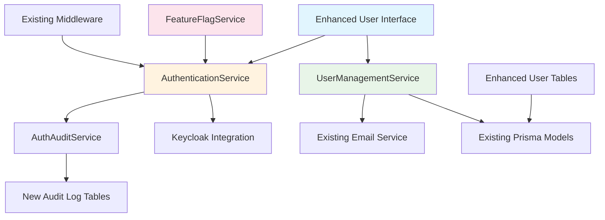

# TIP Security & User Management Enhancement Architecture

## 1. Introduction

This document outlines the architectural approach for enhancing the Transition Intelligence Platform (TIP) with comprehensive security and user management functionality. Its primary goal is to serve as the guiding architectural blueprint for AI-driven development of authentication flows, user management interfaces, and security controls while ensuring seamless integration with the existing system.

**Relationship to Existing Architecture:**
This document supplements the existing TIP architecture by defining how new security components will integrate with the current full-stack system. It provides guidance on maintaining consistency with established patterns while implementing critical security enhancements that address authentication failures, user management interface issues, and missing administrative controls.

### Existing Project Analysis

Based on my analysis of the TIP project, I've identified the following about your existing system:

**Current Project State:**
- **Primary Purpose:** AI-powered SaaS platform for government contract transitions with role-based access control
- **Current Tech Stack:** React 18 + Vite frontend, Node.js Fastify + Python FastAPI backends, PostgreSQL 16, Docker Compose
- **Architecture Style:** Microservices with Traefik reverse proxy, containerized full-stack application
- **Deployment Method:** Docker Compose with multi-service orchestration (frontend, backend-node, backend-python, db, redis, keycloak)

**Available Documentation:**
- Comprehensive README.md with 21-entity data schema documentation
- Complete project structure documentation in `/documents/` folder
- Established API patterns and coding standards
- Docker containerization and deployment procedures
- Extensive troubleshooting and technical debt documentation

**Identified Constraints:**
- Must maintain compatibility with existing 21-entity data schema
- Keycloak integration already established but requires enhancement
- Standard development testing using proper test accounts  
- Government-level security standards required for compliance
- Existing user sessions must remain valid during deployment

### Change Log

| Change | Date | Version | Description | Author |
|--------|------|---------|-------------|--------|
| Initial Architecture Creation | 2025-01-07 | 1.0 | Security & user management enhancement architecture | BMad System Architect |

## 2. Enhancement Scope and Integration Strategy

The security enhancement integrates with the existing TIP system through careful integration points that respect current architectural patterns while addressing critical authentication and user management failures.

**Enhancement Type:** Major Security System Enhancement with UI/UX Integration  
**Scope:** Complete authentication flow implementation, user management interface overhaul, administrative controls addition  
**Integration Impact:** Significant impact requiring substantial existing code changes while maintaining backward compatibility

**Code Integration Strategy:** Enhance existing React components and Fastify API routes while preserving current middleware patterns and state management approaches.

**Database Integration:** Utilize existing Prisma schema and PostgreSQL setup, adding necessary user management fields while maintaining 21-entity relationship integrity.

**API Integration:** Extend current Fastify route structure with new authentication endpoints, following established middleware and error handling patterns.

**UI Integration:** Build upon existing React component architecture, enhancing user management views while maintaining design system consistency and responsive patterns.

**Compatibility Requirements:**
- **Existing API Compatibility:** All current API endpoints must remain functional and backward-compatible
- **Database Schema Compatibility:** User management enhancements must work with existing entity relationships
- **UI/UX Consistency:** New interfaces must follow established Tailwind CSS and component patterns
- **Performance Impact:** Must not exceed current memory usage by more than 15%

## 3. Tech Stack Alignment

### Existing Technology Stack

| Category | Current Technology | Version | Usage in Enhancement | Notes |
|----------|-------------------|---------|---------------------|-------|
| Frontend | React + Vite | 18.x + 5.x | Enhanced with new auth components | Maintain existing component patterns |
| Backend API | Node.js + Fastify | 18.x + 4.x | Extended with auth endpoints | Follow existing middleware structure |
| Database | PostgreSQL + Prisma | 16.x + 5.x | Enhanced user management tables | Maintain existing schema relationships |
| Authentication | Keycloak | 22.0 | Enhanced integration patterns | Extend current configuration |
| Styling | Tailwind CSS + shadcn/ui | Latest | Consistent design system usage | Follow established component library |
| Testing | Cypress E2E | Latest | Extended test coverage | Build on existing test organization |
| Container | Docker + Docker Compose | Latest | No changes to deployment | Maintain current orchestration |

### New Technology Additions

No new technologies required - all enhancements will be implemented using the existing technology stack to ensure compatibility and reduce complexity.

## 4. Data Models and Schema Changes

### New Data Models

#### Enhanced User Management Tracking

**Purpose:** Track additional user management metadata for enhanced security and administrative controls  
**Integration:** Extends existing user entities within current 21-entity schema

**Key Attributes:**
- `lastLoginAttempt`: TIMESTAMP - Track failed login attempts for security monitoring
- `accountStatus`: ENUM - Enhanced status tracking (active, suspended, pending, locked)
- `invitationSentAt`: TIMESTAMP - Track invitation timestamps for resend functionality
- `profileCompletionStatus`: JSON - Track user profile completion for onboarding

**Relationships:**
- **With Existing:** Integrates with current TransitionUsers and Organizations entities
- **With New:** Links to enhanced authentication audit log entries

#### Authentication Audit Log

**Purpose:** Comprehensive audit trail for authentication events and security monitoring  
**Integration:** New entity that references existing user management structures

**Key Attributes:**
- `userId`: UUID - Reference to existing user entities
- `eventType`: ENUM - login_success, login_failure, logout, password_change, etc.
- `ipAddress`: INET - Client IP for security monitoring
- `userAgent`: TEXT - Browser information for session tracking
- `timestamp`: TIMESTAMP - Event occurrence time

**Relationships:**
- **With Existing:** References TransitionUsers entity for audit trail continuity
- **With New:** Standalone audit entity with foreign key relationships

### Schema Integration Strategy

**Database Changes Required:**
- **New Tables:** `auth_audit_log` for authentication event tracking
- **Modified Tables:** Enhanced `TransitionUsers` with additional security metadata columns
- **New Indexes:** Performance indexes on login attempt timestamps and user status fields
- **Migration Strategy:** Incremental schema additions using Prisma migrations with backward compatibility

**Backward Compatibility:**
- All existing queries remain functional with new optional columns having default values
- Existing user data structures maintained without breaking current functionality

## 5. Component Architecture

The new security components follow the existing TIP architectural patterns while adding necessary authentication and user management functionality.

### New Components

#### AuthenticationService

**Responsibility:** Centralized authentication logic handling login, logout, and session management  
**Integration Points:** Integrates with existing Fastify middleware and Keycloak service configuration

**Key Interfaces:**
- `authenticateUser(credentials)` - Login validation against Keycloak
- `validateSession(token)` - Session verification for protected routes
- `logoutUser(sessionId)` - Proper session termination

**Dependencies:**
- **Existing Components:** Current Keycloak configuration, existing middleware patterns
- **New Components:** AuthAuditService for event logging

**Technology Stack:** Node.js with Fastify integration, following existing service patterns

#### UserManagementService

**Responsibility:** Enhanced user management operations including invitations, status updates, and administrative controls  
**Integration Points:** Extends existing user management API routes with enhanced functionality

**Key Interfaces:**
- `inviteUser(userDetails)` - Send user invitations with proper error handling
- `resendInvitation(userId)` - Resend invitation functionality without Bad Request errors
- `updateUserStatus(userId, status)` - Accurate user status management
- `getUserCounts(filters)` - Real-time user count calculations with proper filtering

**Dependencies:**
- **Existing Components:** Current Prisma user models, existing email service integration
- **New Components:** AuthenticationService for user state validation

**Technology Stack:** Node.js service layer following established patterns

#### EnhancedUserInterface

**Responsibility:** React components for authentication flows and enhanced user management interfaces  
**Integration Points:** Integrates with existing component library and state management patterns

**Key Interfaces:**
- `LoginPage` - Complete authentication interface with validation
- `UserManagementDashboard` - Enhanced user management with accurate counts
- `SettingsPage` - Profile management and administrative controls
- `UserProfileModal` - Account settings accessible from avatar dropdown

**Dependencies:**
- **Existing Components:** Current Tailwind CSS configuration, established component patterns
- **New Components:** AuthenticationService for API calls, enhanced state management

**Technology Stack:** React 18 with TypeScript, following existing component architecture

#### FeatureFlagService

**Responsibility:** Feature flag management for gradual authentication rollout and safe deployment  
**Integration Points:** Integrates with existing configuration management and environment variables

**Key Interfaces:**
- `isFeatureEnabled(flagName, userId)` - Check feature flag status for specific users
- `setFeatureFlag(flagName, percentage)` - Set rollout percentage for gradual deployment
- `getUserCohort(userId)` - Determine user's feature flag cohort for consistent experience

**Dependencies:**
- **Existing Components:** Current environment configuration, existing middleware patterns
- **New Components:** AuthenticationService for user context determination

**Technology Stack:** Node.js service following existing patterns with database and environment integration

### Component Interaction Diagram



## 6. API Design and Integration

The API integration strategy enhances existing Fastify routes while maintaining consistency with current patterns and ensuring backward compatibility.

**API Integration Strategy:** Extend existing Fastify route structure with new authentication and user management endpoints  
**Authentication:** Enhanced Keycloak integration with session management and audit logging  
**Versioning:** No versioning required - additive enhancements to existing API structure

### New API Endpoints

#### Authentication Endpoints

**POST /api/auth/login**
- **Purpose:** User authentication with enhanced error handling and audit logging
- **Integration:** Extends existing auth middleware patterns with Keycloak validation

**Request:**
```json
{
  "email": "user@example.com",
  "password": "securepassword",
  "rememberMe": boolean
}
```

**Response:**
```json
{
  "success": true,
  "user": {
    "id": "uuid",
    "email": "user@example.com",
    "role": "user",
    "profileComplete": boolean
  },
  "token": "jwt-token",
  "redirectUrl": "/dashboard"
}
```

#### User Management Endpoints

**POST /api/users/invite**
- **Purpose:** Enhanced user invitation with proper error handling and validation
- **Integration:** Builds on existing user creation patterns with enhanced email functionality

**Request:**
```json
{
  "email": "newuser@example.com",
  "role": "user",
  "organizationId": "uuid",
  "sendEmail": boolean
}
```

**Response:**
```json
{
  "success": true,
  "invitationId": "uuid",
  "message": "Invitation sent successfully",
  "expiresAt": "2025-01-14T10:00:00Z"
}
```

#### User Status Management

**GET /api/users/counts**
- **Purpose:** Real-time user count calculations with accurate filtering
- **Integration:** Optimized queries using existing Prisma models with enhanced aggregation

**Response:**
```json
{
  "total": 150,
  "active": 120,
  "pending": 20,
  "suspended": 10,
  "lastUpdated": "2025-01-07T10:00:00Z"
}
```

## 7. Source Tree Integration

### Existing Project Structure

```
tip-project/
├── frontend/
│   ├── src/
│   │   ├── components/         # Existing React components
│   │   ├── pages/             # Existing page components
│   │   ├── lib/               # Existing utilities
│   │   └── hooks/             # Existing custom hooks
├── backend-node/
│   ├── src/
│   │   ├── routes/            # Existing API routes
│   │   ├── models/            # Existing Prisma models
│   │   ├── services/          # Existing business logic
│   │   └── middleware/        # Existing middleware
└── documents/                 # Project documentation
```

### New File Organization

```
tip-project/
├── frontend/
│   ├── src/
│   │   ├── components/
│   │   │   ├── auth/                    # New authentication components
│   │   │   │   ├── LoginForm.tsx
│   │   │   │   ├── RegistrationForm.tsx
│   │   │   │   └── AuthGuard.tsx
│   │   │   ├── user-management/         # Enhanced user management components
│   │   │   │   ├── UserInviteModal.tsx
│   │   │   │   ├── UserStatusFilters.tsx
│   │   │   │   └── UserAccessControls.tsx
│   │   │   └── settings/                # New settings components
│   │   │       ├── ProfileSettings.tsx
│   │   │       └── SystemLogsToggle.tsx
│   │   ├── pages/
│   │   │   ├── LoginPage.tsx            # New login page
│   │   │   ├── RegisterPage.tsx         # New registration page
│   │   │   └── enhanced-existing/       # Enhanced existing pages
│   │   └── hooks/
│   │       ├── useAuth.tsx              # Enhanced authentication hook
│   │       └── useUserManagement.tsx    # New user management hook
├── backend-node/
│   ├── src/
│   │   ├── routes/
│   │   │   ├── auth/                    # New authentication routes
│   │   │   │   ├── login.ts
│   │   │   │   ├── logout.ts
│   │   │   │   └── register.ts
│   │   │   └── users/                   # Enhanced user management routes
│   │   │       ├── invite.ts            # Enhanced invitation functionality
│   │   │       └── counts.ts            # Accurate user counting
│   │   ├── services/
│   │   │   ├── AuthenticationService.ts # New authentication service
│   │   │   ├── UserManagementService.ts # Enhanced user management
│   │   │   └── AuditService.ts          # New audit logging service
│   │   ├── middleware/
│   │   │   ├── authBypass.ts            # Development auth bypass
│   │   │   └── enhanced-existing/       # Enhanced existing middleware
│   │   └── models/
│   │       └── enhanced-schema/         # Enhanced Prisma schema
└── docs/                               # Architecture documentation
    ├── security-architecture.md        # This document
    └── security-user-management-enhancement-prd.md
```

### Integration Guidelines

- **File Naming:** Follow existing camelCase for TypeScript files, kebab-case for component directories
- **Folder Organization:** Group related functionality in dedicated folders while maintaining existing hierarchy
- **Import/Export Patterns:** Use existing barrel export patterns and maintain consistent import organization

## 8. Infrastructure and Deployment Integration

### Existing Infrastructure

**Current Deployment:** Docker Compose multi-service orchestration with Traefik reverse proxy  
**Infrastructure Tools:** Docker, Docker Compose, Traefik for routing, existing service configuration  
**Environments:** Development with proper test accounts, production-ready containerized deployment with feature flags

### Enhancement Deployment Strategy

**Deployment Approach:** Maintain existing Docker Compose setup with enhanced service configurations and feature flag support  
**Infrastructure Changes:** No infrastructure changes required - enhancements work within current containerization  
**Pipeline Integration:** Builds on existing Docker build processes with enhanced health checks for authentication services

**Session Preservation Implementation:**
- JWT token refresh endpoint maintains user sessions during authentication system updates
- Session migration service preserves existing user login state during deployment phases
- Graceful degradation ensures users remain logged in during system transitions
- Database session store maintains continuity between old and new authentication flows

**Feature Flag Deployment Strategy:**
- Environment variable configuration: `FEATURE_FLAGS_CONFIG` with JSON flag definitions
- Database override capability for runtime flag adjustments without deployments
- User cohort assignment based on user ID hash for consistent experience
- Gradual rollout monitoring with automatic rollback triggers for authentication failures

### Rollback Strategy

**Rollback Method:** Database migration rollback procedures with Docker Compose service restoration  
**Risk Mitigation:** Gradual feature rollout using environment-specific configuration flags  
**Monitoring:** Enhanced logging for authentication events with existing log aggregation patterns

## 9. Coding Standards and Conventions

### Existing Standards Compliance

**Code Style:** TypeScript strict mode, ESLint configuration, Prettier formatting  
**Linting Rules:** Existing ESLint setup with React and TypeScript rules  
**Testing Patterns:** Cypress E2E testing, component testing patterns  
**Documentation Style:** Inline JSDoc comments, comprehensive README patterns

### Enhancement-Specific Standards

- **Authentication Security:** All authentication functions must include audit logging and error handling
- **User Management Consistency:** User status changes must maintain referential integrity with existing entities
- **Development Features:** Auth bypass functionality must include environment validation and security warnings

### Critical Integration Rules

- **Existing API Compatibility:** New endpoints must not break existing API contracts or middleware chains
- **Database Integration:** All database changes must maintain foreign key relationships and existing query patterns
- **Error Handling:** Authentication errors must follow established error response patterns and user feedback mechanisms
- **Logging Consistency:** Security events must integrate with existing Fastify logging configuration and patterns

## 10. Testing Strategy

### Integration with Existing Tests

**Existing Test Framework:** Cypress E2E testing with established test organization and patterns  
**Test Organization:** Tests organized by feature area with helper functions and common utilities  
**Coverage Requirements:** Maintain existing coverage standards while adding comprehensive security test coverage

### New Testing Requirements

#### Unit Tests for New Components

- **Framework:** Jest with React Testing Library for component testing
- **Location:** Adjacent `__tests__` directories following existing patterns
- **Coverage Target:** 90% coverage for new authentication and user management components
- **Integration with Existing:** Build on existing test utilities and mock patterns

#### Integration Tests

- **Scope:** End-to-end authentication flows, user management operations, and API integration testing
- **Existing System Verification:** Ensure existing functionality remains intact during security enhancements
- **New Feature Testing:** Comprehensive testing of login flows, user invitations, and administrative controls

#### Regression Testing

- **Existing Feature Verification:** Automated verification that existing user management and navigation continue to function
- **Automated Regression Suite:** Integration with existing Cypress test suite for continuous validation
- **Manual Testing Requirements:** User acceptance testing for authentication flows and administrative interfaces

## 11. Security Integration

### Existing Security Measures

**Authentication:** Keycloak integration with session management  
**Authorization:** Role-based access control with TransitionUsers entity relationships  
**Data Protection:** PostgreSQL with encryption at rest, secure Docker networking  
**Security Tools:** Established Keycloak configuration, existing middleware patterns

### Enhancement Security Requirements

**New Security Measures:** Enhanced audit logging, failed login attempt tracking, session security improvements  
**Integration Points:** Authentication middleware enhancement, user management security controls, administrative access validation  
**Compliance Requirements:** Government-level security standards with comprehensive audit trails

### Security Testing

**Existing Security Tests:** Basic authentication flow testing in Cypress E2E suite  
**New Security Test Requirements:** Authentication security testing, authorization verification, audit trail validation  
**Penetration Testing:** Manual security testing of authentication flows and user management administrative controls

## 12. Next Steps

### Story Manager Handoff

**Reference Documentation:** Use this security architecture document and the security-user-management-enhancement-prd.md for comprehensive story creation  
**Key Integration Requirements:** Maintain compatibility with existing 21-entity schema, preserve current user sessions, follow established React component patterns  
**Existing System Constraints:** Work within current Docker Compose setup, maintain Keycloak integration patterns, preserve existing middleware functionality  
**First Story Implementation:** Begin with Story 1.1 (Authentication Foundation) with clear checkpoints for Keycloak integration validation and existing session preservation  
**System Integrity Focus:** Each story must include verification steps that existing functionality continues to work properly throughout implementation

### Developer Handoff

**Architecture Reference:** Follow this document's component architecture and integration patterns based on actual TIP project analysis  
**Integration Requirements:** Maintain existing Fastify middleware patterns, preserve current React component architecture, work within established database schema relationships  
**Technical Decisions:** Use existing technology stack without additions, follow current coding standards and linting rules, maintain Docker containerization approaches  
**Compatibility Requirements:** Verify existing API endpoints continue functioning, ensure current user data remains accessible, maintain backward compatibility for all database operations  
**Implementation Sequencing:** Implement authentication foundation first, then user management enhancements, followed by administrative controls to minimize risk to existing functionality

---

**🏗️ Architecture Status:** Complete and ready for development  
**📁 Save Location:** `/docs/security-architecture.md`  
**Next Phase:** Product Owner validation and story creation workflow