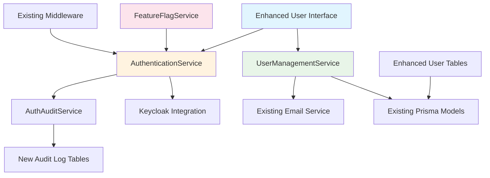

# TIP Security & User Management Enhancement Architecture

This document outlines the architectural approach for enhancing the Transition Intelligence Platform (TIP) with comprehensive security and user management functionality.

## Intro Project Analysis and Context

### Analysis Source

- **Source Type**: IDE-based analysis with existing project documentation  
- **Documentation Review**: Comprehensive README.md and `/documents/` folder analysis
- **Current System Understanding**: Based on existing architecture documentation and reported issues

### Current Project State

The Transition Intelligence Platform (TIP) is an AI-powered SaaS platform for government contract transitions with:

- **Architecture**: Full-stack application (React frontend, Node.js/Python backends, PostgreSQL)
- **Authentication**: Keycloak-based with standard authentication flows
- **User Management**: Role-based access control with 21 core entities
- **Current Status**: Production-ready foundation with critical security/user management failures

### Available Documentation Analysis

✅ **Available Documentation**:

- ✅ Tech Stack Documentation (comprehensive)
- ✅ Source Tree/Architecture (21-entity data schema documented)  
- ✅ API Documentation (Fastify-based Node.js API)
- ✅ External API Documentation (Keycloak, PostgreSQL patterns)
- ✅ Technical Debt Documentation (extensive troubleshooting guide)
- ❌ UX/UI Guidelines (partial - needs enhancement)
- ❌ Security Testing Documentation (gap identified)

**Documentation Status**: Adequate for comprehensive enhancement planning

### Enhancement Scope Definition

✅ **Primary Types Identified**:

- **Bug Fix and Stability Improvements** (authentication failures)
- **UI/UX Overhaul** (user management interface issues)
- **Major Feature Modification** (complete auth flow redesign)
- **Integration with New Systems** (proper login/logout flow)

### Enhancement Description  

Comprehensive security and user management system overhaul addressing authentication flow failures, user interface malfunctions, and missing critical features. This enhancement will establish a complete, functional security foundation for the TIP platform.

### Impact Assessment

✅ **Significant Impact (substantial existing code changes)**

- Authentication system redesign required
- User management UI complete rebuild needed  
- API endpoints require security audit and fixes
- Database user management queries need verification
- Frontend components require comprehensive testing

### Goals and Background Context

### Goals

- Establish fully functional authentication flow (login, logout, registration)
- Implement reliable user invitation and management system
- Create accurate user status tracking and filtering
- Develop comprehensive user access control interface
- Support development environment testing with proper test accounts
- Implement system logs access for administrators

### Background Context

The TIP platform has been built with a solid architectural foundation but is experiencing critical failures in its security and user management systems. These issues prevent proper user onboarding, access control, and system administration - essential functions for a government contracting platform requiring strict security compliance. The current failures include non-functional authentication flows, inaccurate user counts, broken invitation systems, and missing administrative interfaces.

This enhancement is crucial for platform security, user experience, and operational functionality. Without these fixes, the platform cannot support multi-user scenarios or meet government security standards.

### Change Log

| Change | Date | Version | Description | Author |
|--------|------|---------|-------------|--------|
| Initial PRD Creation | 2025-01-07 | 1.0 | Comprehensive security & user management enhancement scope | BMad PM Agent |

## Tech Stack Alignment

### Existing Technology Stack

| Category | Current Technology | Version | Usage in Enhancement | Notes |
|----------|-------------------|---------|---------------------|-------|
| Frontend | React + Vite | 18.x + 5.x | Enhanced with new auth components | Maintain existing component patterns |
| Backend API | Node.js + Fastify | 18.x + 4.x | Extended with auth endpoints | Follow existing middleware structure |
| Database | PostgreSQL + Prisma | 16.x + 5.x | Enhanced user management tables | Maintain existing schema relationships |
| Authentication | Keycloak | 22.0 | Enhanced integration patterns | Extend current configuration |
| Styling | Tailwind CSS + shadcn/ui | Latest | Consistent design system usage | Follow established component library |
| Testing | Cypress E2E | Latest | Extended test coverage | Build on existing test organization |
| Container | Docker + Docker Compose | Latest | No changes to deployment | Maintain current orchestration |

### New Technology Additions

No new technologies required - all enhancements will be implemented using the existing technology stack to ensure compatibility and reduce complexity.

## Component Architecture

The new security components follow the existing TIP architectural patterns while adding necessary authentication and user management functionality.

### New Components

#### AuthenticationService

**Responsibility:** Centralized authentication logic handling login, logout, and session management  
**Integration Points:** Integrates with existing Fastify middleware and Keycloak service configuration

**Key Interfaces:**
- `authenticateUser(credentials)` - Login validation against Keycloak
- `validateSession(token)` - Session verification for protected routes
- `logoutUser(sessionId)` - Proper session termination

**Dependencies:**
- **Existing Components:** Current Keycloak configuration, existing middleware patterns
- **New Components:** AuthAuditService for event logging

**Technology Stack:** Node.js with Fastify integration, following existing service patterns

#### UserManagementService

**Responsibility:** Enhanced user management operations including invitations, status updates, and administrative controls  
**Integration Points:** Extends existing user management API routes with enhanced functionality

**Key Interfaces:**
- `inviteUser(userDetails)` - Send user invitations with proper error handling
- `resendInvitation(userId)` - Resend invitation functionality without Bad Request errors
- `updateUserStatus(userId, status)` - Accurate user status management
- `getUserCounts(filters)` - Real-time user count calculations with proper filtering

**Dependencies:**
- **Existing Components:** Current Prisma user models, existing email service integration
- **New Components:** AuthenticationService for user state validation

**Technology Stack:** Node.js service layer following established patterns

#### EnhancedUserInterface

**Responsibility:** React components for authentication flows and enhanced user management interfaces  
**Integration Points:** Integrates with existing component library and state management patterns

**Key Interfaces:**
- `LoginPage` - Complete authentication interface with validation
- `UserManagementDashboard` - Enhanced user management with accurate counts
- `SettingsPage` - Profile management and administrative controls
- `UserProfileModal` - Account settings accessible from avatar dropdown

**Dependencies:**
- **Existing Components:** Current Tailwind CSS configuration, established component patterns
- **New Components:** AuthenticationService for API calls, enhanced state management

**Technology Stack:** React 18 with TypeScript, following existing component architecture

#### FeatureFlagService

**Responsibility:** Feature flag management for gradual authentication rollout and safe deployment  
**Integration Points:** Integrates with existing configuration management and environment variables

**Key Interfaces:**
- `isFeatureEnabled(flagName, userId)` - Check feature flag status for specific users
- `setFeatureFlag(flagName, percentage)` - Set rollout percentage for gradual deployment
- `getUserCohort(userId)` - Determine user's feature flag cohort for consistent experience

**Dependencies:**
- **Existing Components:** Current environment configuration, existing middleware patterns
- **New Components:** AuthenticationService for user context determination

**Technology Stack:** Node.js service following existing patterns with database and environment integration

### Component Interaction Diagram



## Source Tree Integration

### Existing Project Structure

```
tip-project/
├── frontend/
│   ├── src/
│   │   ├── components/         # Existing React components
│   │   ├── pages/             # Existing page components
│   │   ├── lib/               # Existing utilities
│   │   └── hooks/             # Existing custom hooks
├── backend-node/
│   ├── src/
│   │   ├── routes/            # Existing API routes
│   │   ├── models/            # Existing Prisma models
│   │   ├── services/          # Existing business logic
│   │   └── middleware/        # Existing middleware
└── documents/                 # Project documentation
```

### New File Organization

```
tip-project/
├── frontend/
│   ├── src/
│   │   ├── components/
│   │   │   ├── auth/                    # New authentication components
│   │   │   │   ├── LoginForm.tsx
│   │   │   │   ├── RegistrationForm.tsx
│   │   │   │   └── AuthGuard.tsx
│   │   │   ├── user-management/         # Enhanced user management components
│   │   │   │   ├── UserInviteModal.tsx
│   │   │   │   ├── UserStatusFilters.tsx
│   │   │   │   └── UserAccessControls.tsx
│   │   │   └── settings/                # New settings components
│   │   │       ├── ProfileSettings.tsx
│   │   │       └── SystemLogsToggle.tsx
│   │   ├── pages/
│   │   │   ├── LoginPage.tsx            # New login page
│   │   │   ├── RegisterPage.tsx         # New registration page
│   │   │   └── enhanced-existing/       # Enhanced existing pages
│   │   └── hooks/
│   │       ├── useAuth.tsx              # Enhanced authentication hook
│   │       └── useUserManagement.tsx    # New user management hook
├── backend-node/
│   ├── src/
│   │   ├── routes/
│   │   │   ├── auth/                    # New authentication routes
│   │   │   │   ├── login.ts
│   │   │   │   ├── logout.ts
│   │   │   │   └── register.ts
│   │   │   └── users/                   # Enhanced user management routes
│   │   │       ├── invite.ts            # Enhanced invitation functionality
│   │   │       └── counts.ts            # Accurate user counting
│   │   ├── services/
│   │   │   ├── AuthenticationService.ts # New authentication service
│   │   │   ├── UserManagementService.ts # Enhanced user management
│   │   │   ├── AuditService.ts          # New audit logging service
│   │   │   └── FeatureFlagService.ts    # New feature flag service
│   │   ├── middleware/
│   │   │   └── enhanced-existing/       # Enhanced existing middleware
│   │   └── models/
│   │       └── enhanced-schema/         # Enhanced Prisma schema
└── docs/                               # Architecture documentation
    ├── prd/                            # Sharded PRD documents
    └── architecture/                   # Sharded architecture documents
```

### Integration Guidelines

- **File Naming:** Follow existing camelCase for TypeScript files, kebab-case for component directories
- **Folder Organization:** Group related functionality in dedicated folders while maintaining existing hierarchy
- **Import/Export Patterns:** Use existing barrel export patterns and maintain consistent import organization

## Coding Standards and Conventions

### Existing Standards Compliance

**Code Style:** TypeScript strict mode, ESLint configuration, Prettier formatting  
**Linting Rules:** Existing ESLint setup with React and TypeScript rules  
**Testing Patterns:** Cypress E2E testing, component testing patterns  
**Documentation Style:** Inline JSDoc comments, comprehensive README patterns

### Enhancement-Specific Standards

- **Authentication Security:** All authentication functions must include audit logging and error handling
- **User Management Consistency:** User status changes must maintain referential integrity with existing entities
- **Feature Flag Implementation:** Feature flag checks must be consistent and include fallback behavior

### Critical Integration Rules

- **Existing API Compatibility:** New endpoints must not break existing API contracts or middleware chains
- **Database Integration:** All database changes must maintain foreign key relationships and existing query patterns
- **Error Handling:** Authentication errors must follow established error response patterns and user feedback mechanisms
- **Logging Consistency:** Security events must integrate with existing Fastify logging configuration and patterns

## Requirements

### Functional Requirements

**FR1**: The authentication system shall provide complete login functionality with username/password validation against Keycloak identity provider.

**FR2**: The system shall implement proper logout functionality that terminates user sessions and redirects to login page.

**FR3**: The platform shall include user registration functionality for new account creation with appropriate validation.

**FR4**: The invite user functionality shall successfully send invitations via email with proper error handling and success feedback.

**FR5**: The resend invitation feature shall work without returning Bad Request errors and provide user feedback.

**FR6**: User count displays shall accurately reflect filtered user states (Suspended, Pending, Active) in real-time.

**FR7**: The Access button on user cards shall display appropriate user permission and role information.

**FR8**: The Account button under user Avatar shall open user profile management interface.

**FR9**: The Settings interface shall provide comprehensive persona settings and configuration options.

**FR10**: The Settings tab shall include administrator toggle for accessing system logs.

**FR11**: All user management operations shall maintain existing data integrity and audit trail requirements.

**FR12**: The authentication system shall support gradual rollout through feature flags to ensure safe deployment.

### Non-Functional Requirements

**NFR1**: Authentication operations shall complete within 2 seconds under normal load conditions.

**NFR2**: User interface responses shall provide immediate feedback for all user actions (loading states, success/error messages).

**NFR3**: The system shall maintain existing performance characteristics and not exceed current memory usage by more than 15%.

**NFR4**: All authentication and user management operations shall be logged for audit compliance.

**NFR5**: The enhancement shall maintain backward compatibility with existing user data and session management.

**NFR6**: Security enhancements shall meet government-level security standards and encryption requirements.

**NFR7**: User interface shall remain responsive across all supported browsers and device sizes.

### Compatibility Requirements

**CR1: Existing API Compatibility**: All current API endpoints must remain functional and backward-compatible with existing frontend calls.

**CR2: Database Schema Compatibility**: User management enhancements must work with the existing 21-entity data schema without breaking current relationships.

**CR3: UI/UX Consistency**: New authentication and user management interfaces must follow existing design patterns, Tailwind CSS usage, and component structure.

**CR4: Integration Compatibility**: Keycloak integration must maintain current configuration while adding missing functionality.
